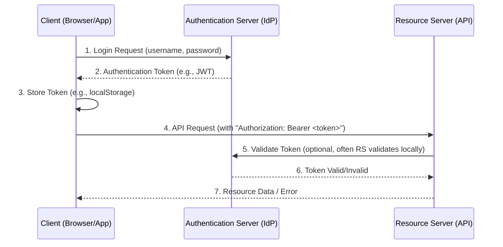

## Mental model
Authentication is like presenting an ID to prove who you are. Instead of repeatedly showing your primary ID (e.g., username/password) every time you want to access a protected resource, a server might issue you a temporary, verifiable pass – an **authentication token** – after your initial successful ID check. This token acts as a digital credential. A **bearer token** is a specific type of pass where anyone *bearing* or possessing it is granted access, making its security paramount. **Single Sign-On (SSO)** extends this concept by allowing one such pass to grant access across multiple distinct services or applications, streamlining the user experience and centralizing identity management.

## Diagram


## Prerequisites
1.  **HTTP Basics**: Understanding of how web clients (browsers, mobile apps) make requests to servers, including HTTP methods (GET, POST), status codes, and the concept of request/response headers.
2.  **Client-Server Architecture**: Familiarity with how applications are structured with distinct client and server components that communicate over a network.
3.  **Stateless vs. Stateful Communication**: The difference between a server maintaining session-specific information for a client (stateful) versus processing each request independently without prior context (stateless).
4.  **Basic Cryptography Concepts**: A general understanding of hashing (one-way functions) and digital signatures (verifying data integrity and origin).

## How it actually works

### 1. The Authentication Process (General)
At its core, authentication is about verifying a user's identity.
1.  **Identification**: The user claims an identity (e.g., "I am Alice").
2.  **Proof**: The user provides credentials to prove that identity (e.g., Alice's password, a fingerprint, a token).
3.  **Verification**: The system checks these credentials against a stored record.
4.  **Authorization (often follows)**: Once authenticated, the system determines what the user is *allowed* to do.

### 2. Tokens in Authentication
Instead of re-verifying credentials on every request, servers issue tokens after initial authentication. These tokens are cryptographically secured strings that contain information about the authenticated user and typically have an expiration time. They allow for stateless authentication, meaning the server doesn't need to store session data for each client.

### 3. Bearer Tokens
A bearer token is the most common type of access token used in modern web APIs. The term "bearer" implies that whoever *bears* (possesses) the token is granted access. There's no further proof of identity required from the client beyond presenting the token. This makes them powerful but also means they must be protected from theft.

**How they are transmitted:**
Bearer tokens are almost always sent in the `Authorization` HTTP header of a request.
`Authorization: Bearer <YOUR_TOKEN_STRING_HERE>`

### 4. JSON Web Tokens (JWTs)
JWTs are a popular open standard (`RFC 7519`) for creating tokens that are compact, URL-safe, and digitally signed. They are typically used as bearer tokens. A JWT consists of three parts, separated by dots (`.`):

`header.payload.signature`

#### a. Header
A JSON object specifying the token type (JWT) and the signing algorithm used (e.g., HMAC SHA256 or RSA).
```json
{
  "alg": "HS256",
  "typ": "JWT"
}
```
This JSON is then Base64Url encoded.

#### b. Payload (Claims)
A JSON object containing "claims" about the entity (typically the user) and additional data. Claims are statements about an entity. There are three types of claims:
*   **Registered Claims**: Standard, non-mandatory claims like `iss` (issuer), `exp` (expiration time), `sub` (subject/user ID), `aud` (audience).
*   **Public Claims**: Custom claims defined by JWT users, but to avoid collisions, they should be registered in the IANA "JSON Web Token Claims" registry or be a URI that contains a collision-resistant namespace.
*   **Private Claims**: Custom claims created to share information between parties that agree on their meaning.
```json
{
  "sub": "1234567890",
  "name": "John Doe",
  "iat": 1516239022,
  "exp": 1516242622, // e.g., 1 hour from iat
  "role": "admin"
}
```
This JSON is also Base64Url encoded.

#### c. Signature
The signature is created by taking the encoded header, the encoded payload, a secret key (or a private key in the case of RSA), and the algorithm specified in the header, then applying the signing algorithm.
`HMACSHA256(base64UrlEncode(header) + "." + base64UrlEncode(payload), secret)`

The signature is used by the server to verify that the token hasn't been tampered with and was indeed issued by a trusted party.

### 5. Types of Authentication
*   **Password-based (Traditional)**: User submits username/password. Server creates a session, often stored in a cookie. Stateful.
*   **Basic Authentication**: User sends `Authorization: Basic <base64(username:password)>` with every request. Simple but insecure without HTTPS, as credentials are sent repeatedly.
*   **API Keys**: A static, secret key provided to clients (e.g., for machine-to-machine communication). Less suitable for user authentication due to difficulty in revocation and distribution.
*   **Token-based (e.g., JWTs)**: After initial login, a token is issued. Client sends this token with subsequent requests. Stateless, scalable.
*   **OAuth 2.0**: An authorization framework, not strictly authentication. It allows a user to grant a third-party application limited access to their resources on another service (e.g., "Login with Google" allows an app to access your Google profile, but Google authenticates you). It uses tokens (access tokens, refresh tokens) for this delegated authorization.
*   **OpenID Connect (OIDC)**: An authentication layer built on top of OAuth 2.0. It allows clients to verify the identity of the end-user based on the authentication performed by an authorization server, as well as to obtain basic profile information about the end-user. This is commonly used for SSO.

### 6. Single Sign-On (SSO)
SSO is an authentication scheme that allows a user to log in with a single ID and password to gain access to multiple related, yet independent, software systems.

**How SSO works (simplified via OIDC/OAuth2):**
1.  **Identity Provider (IdP)**: A trusted entity that authenticates users and issues security assertions (e.g., Google, Okta, Auth0).
2.  **Service Provider (SP)**: The application or service that relies on the IdP for authentication.
3.  **Flow**:
    *   User tries to access an SP.
    *   SP redirects the user's browser to the IdP for login.
    *   User logs into the IdP.
    *   IdP authenticates the user and creates a session.
    *   IdP redirects the user back to the SP, often with an `ID Token` (a JWT containing user identity info) and an `Access Token` (for accessing IdP APIs) via a secure channel.
    *   SP verifies the `ID Token`'s signature and expiration, extracts user info, and logs the user into its own application.
    *   Now, when the user accesses another SP that also uses the same IdP, they are already logged into the IdP, so no re-login is required. The IdP simply issues new tokens for the new SP.

## Two examples

### Example 1 — Canonical JWT Bearer Token Flow
A user logs into a web application.

```javascript
// Client-side (e.g., React app)
// 1. User submits login form
async function login(username, password) {
  const response = await fetch('/api/login', {
    method: 'POST',
    headers: { 'Content-Type': 'application/json' },
    body: JSON.stringify({ username, password })
  });

  if (response.ok) {
    const { token } = await response.json();
    localStorage.setItem('jwt_token', token); // Store the token
    console.log('Logged in successfully!');
  } else {
    console.error('Login failed.');
  }
}

// 2. Later, client makes a request to a protected API
async function getProtectedData() {
  const token = localStorage.getItem('jwt_token');
  if (!token) {
    console.error('No token found, please log in.');
    return;
  }

  const response = await fetch('/api/data', {
    headers: {
      'Authorization': `Bearer ${token}` // Send the bearer token
    }
  });

  if (response.ok) {
    const data = await response.json();
    console.log('Protected data:', data);
  } else if (response.status === 401) {
    console.error('Unauthorized: Token might be expired or invalid.');
    localStorage.removeItem('jwt_token'); // Clear invalid token
  } else {
    console.error('Failed to fetch protected data.');
  }
}

// Server-side (simplified Node.js with Express and jsonwebtoken)
// Assume 'users' is a DB and 'SECRET_KEY' is an environment variable
const express = require('express');
const jwt = require('jsonwebtoken');
const app = express();
app.use(express.json());

// Login endpoint
app.post('/api/login', (req, res) => {
  const { username, password } = req.body;
  // In a real app, hash password and compare with DB
  if (username === 'user' && password === 'pass') {
    const token = jwt.sign({ userId: 123, role: 'user' }, process.env.SECRET_KEY, { expiresIn: '1h' });
    res.json({ token });
  } else {
    res.status(401).send('Invalid credentials');
  }
});

// Middleware to protect routes
function authenticateToken(req, res, next) {
  const authHeader = req.headers['authorization'];
  const token = authHeader && authHeader.split(' ')[1]; // Expects "Bearer TOKEN"

  if (token == null) return res.sendStatus(401); // No token

  jwt.verify(token, process.env.SECRET_KEY, (err, user) => {
    if (err) return res.sendStatus(403); // Invalid token (e.g., expired, bad signature)
    req.user = user; // Attach user payload to request
    next();
  });
}

// Protected endpoint
app.get('/api/data', authenticateToken, (req, res) => {
  res.json({ message: `Welcome ${req.user.userId}, you are a ${req.user.role}. This is protected data.` });
});
```

### Example 2 — Wrong-but-tempting / Edge Case: Client-Side Token Storage Vulnerability
A common mistake is to store sensitive authentication tokens in insecure locations or transmit them over unencrypted channels.

```javascript
// Client-side (vulnerable)
// Storing token in a global variable or unencrypted cookie without HttpOnly
let globalToken = ''; // BAD: easily accessible via XSS

async function loginAndStoreInGlobal() {
  // ... login logic ...
  const { token } = await response.json();
  globalToken = token; // Vulnerable to Cross-Site Scripting (XSS) attacks
}

// Or, sending token over HTTP instead of HTTPS
// BAD: Token can be intercepted by Man-in-the-Middle (MITM) attacks
async function sendTokenOverHTTP() {
  const token = localStorage.getItem('jwt_token');
  await fetch('http://api.example.com/sensitive', { // Note: http://
    headers: { 'Authorization': `Bearer ${token}` }
  });
}
```
**Why it's wrong:**
*   Storing tokens in accessible client-side JavaScript variables or non-HttpOnly cookies makes them vulnerable to Cross-Site Scripting (XSS) attacks. An attacker injecting malicious JavaScript could steal the token and impersonate the user.
*   Sending tokens over unencrypted HTTP exposes them to Man-in-the-Middle (MITM) attacks, where an attacker can intercept and steal the token. All token-based communication **must** use HTTPS.
*   The "bearer" nature means possession is proof. If an attacker gets the token, they are the user.

## Why it's written this way
Token-based authentication, particularly using JWT bearer tokens, has become popular due to several advantages over traditional session-cookie-based authentication:

1.  **Statelessness**: The server doesn't need to store session data. Each request contains all necessary authentication information within the token. This greatly simplifies server architecture and improves scalability, especially for distributed systems and microservices, as any server can validate the token without querying a central session store.
2.  **Scalability**: Without session state, it's easier to scale horizontally by adding more servers, as they don't need to share session data.
3.  **Cross-Origin/Domain Compatibility**: Tokens are easily sent across different domains (e.g., an API on `api.example.com` and a frontend on `app.example.com`) without the same-origin policy restrictions that apply to cookies.
4.  **Mobile-Friendly**: Tokens are a natural fit for mobile applications, which often communicate with APIs and don't rely on browser-specific cookie mechanisms.
5.  **Decoupling**: The authentication server (IdP) can be separate from the resource servers (APIs), allowing for a clear separation of concerns and easier integration with third-party authentication providers or SSO solutions.

**Alternatives and Trade-offs:**
*   **Session Cookies**: Stateful. Server needs to maintain session data. Simpler for single-server, monolithic applications. More resilient to XSS if `HttpOnly` and `SameSite` flags are used effectively, but vulnerable to CSRF without proper protection.
*   **Basic Authentication**: Simple, but sends credentials on every request. Not suitable for user-facing applications due to security and UX.
*   **API Keys**: Good for machine-to-machine, but poor for user authentication due to static nature and management overhead.

JWTs trade off server-side session management for client-side storage responsibility and the need for robust token revocation mechanisms (since a signed JWT is valid until expiration unless explicitly revoked).

## Failure modes
1.  **Token Theft (XSS)**: If an application is vulnerable to Cross-Site Scripting (XSS), an attacker can inject malicious JavaScript to steal tokens stored in `localStorage` or `sessionStorage`. Once stolen, the attacker can impersonate the user until the token expires.
2.  **Weak Secret Key**: If the server's secret key used to sign JWTs is weak, guessable, or compromised, an attacker can forge valid tokens, granting themselves unauthorized access.
3.  **Lack of Token Revocation**: JWTs are typically valid until their `exp` (expiration) claim. If a token is stolen or a user's permissions change, there's no built-in way to "un-sign" a token before it expires. This often requires implementing a "blacklist" or "revocation list" on the server, which reintroduces some statefulness.
4.  **Improper Expiration Handling**: Tokens that expire too quickly lead to poor user experience (frequent re-logins). Tokens that expire too slowly increase the window of vulnerability if stolen. A common pattern uses short-lived access tokens and longer-lived refresh tokens.
5.  **Man-in-the-Middle (MITM) Attacks**: If tokens are transmitted over unencrypted HTTP (instead of HTTPS), an attacker can intercept and steal the token, gaining unauthorized access.
6.  **CSRF Vulnerability (with cookies)**: While not a direct token vulnerability, if tokens are stored in cookies without proper `SameSite` attributes or CSRF tokens, a Cross-Site Request Forgery attack could trick a user's browser into sending their token to a malicious site.

## Quiz

### Q1
Consider a web application that uses JWT bearer tokens for authentication. A user logs in, receives a token, and then makes several API requests. If the server's clock is significantly ahead of the client's clock, what potential issue could arise regarding token validation, assuming the `nbf` (not before) and `exp` (expiration) claims are strictly enforced?

**Answer:** If the server's clock is ahead, a token issued by the server might immediately appear "expired" (`exp` in the past) or "not yet valid" (`nbf` in the future) to the client, even though it was just issued. This would lead to `403 Forbidden` errors for the client, preventing them from using the token effectively right after login, causing an authentication failure due to clock skew.

### Q2
In the canonical example, why is the `Authorization` header typically structured as `Authorization: Bearer <token>` instead of just `Authorization: <token>`? What is the purpose of the "Bearer" prefix?

**Answer:** The "Bearer" prefix is a standard scheme defined in `RFC 6750` for HTTP authentication. It explicitly indicates the authentication scheme being used. While technically you could omit it and have a custom scheme, using "Bearer" makes the token type clear to both clients and servers, improving interoperability and allowing servers to potentially support multiple authentication schemes (e.g., `Basic`, `Digest`, `Bearer`). It acts as a hint to the server about how to interpret the subsequent token string.

### Q3
If a JWT's payload contains sensitive user information (e.g., full address, social security number) and this JWT is stolen, what is the immediate security implication, even if the signature is valid and the token hasn't expired?

**Answer:** Even if the signature is valid and the token hasn't expired, a stolen JWT with sensitive information in its payload immediately exposes that data. The payload of a JWT is only Base64Url encoded, not encrypted. This means anyone who gets hold of the token can easily decode the header and payload to read its contents. Therefore, sensitive information should *never* be stored directly in a JWT payload; only non-sensitive identifiers or claims should be included.

## Links
- **Prerequisite:** [[http-basics]] — Understanding HTTP requests, responses, and headers is fundamental to grasping how tokens are transmitted.
