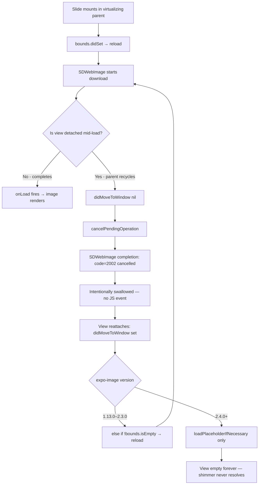

**Topic:** expo-image virtualization regression and RN carousel trade-offs
**Tags:** react-native, expo-image, virtualization, carousel, reanimated, flashlist, sdwebimage, ios, performance
**Summary:** Post-mortem of a four-layer bug stack where expo-image 2.4.0 broke virtualizing-parent compatibility, plus the carousel-architecture lessons that followed.

## Mental model

A React Native screen that displays a list of images is really a contract between three layers: the list/carousel decides which children stay mounted, the image library decides what to do when those children get attached or detached from the window, and the native layer (SDWebImage / Glide) handles the actual byte-fetching. Each layer makes assumptions about the others. When one layer changes its assumptions — like expo-image silently dropping its retry-on-reattach path in 2.4.0 — every consumer that relied on the implicit contract starts failing, but only on specific code paths (cells that detach during loading). The bug looks like "stuck loading" but is really "silent operation cancelled with no recovery path." Understanding why that's possible (intentional swallow of cancel errors + missing retry hook) is the load-bearing insight.

## Diagram



## Prerequisites

- React Native list virtualization model (cells mount/unmount as you scroll; `removeClippedSubviews` and `windowSize` control eviction)
- iOS `didMoveToWindow` lifecycle — fires with `window == nil` on detach, `window != nil` on attach
- The difference between a *cancelled* native operation (intentional, suppressed) and a *failed* one (surfaces as `onError`)
- Reanimated's three-thread model: JS thread, UI thread (worklets), and the native compositor

## How it actually works

The Discovery Journey screen renders ~22 full-screen banner images. The original symptom: banners visible during the first navigation loaded fine; banners that scrolled into view *during* a swipe got stuck on shimmer indefinitely. Two days of instrumentation surfaced four distinct layered bugs.

**Bug 1 — expo-image 2.4.0 regression.** Diffing `ios/ImageView.swift` across all 2.x versions from npm tarballs revealed exactly one functional difference. Versions 1.13.0 through 2.3.0 had this:

```swift
public override func didMoveToWindow() {
  if window == nil {
    cancelPendingOperation()
  } else if !bounds.isEmpty {
    reload()                          // ← the retry path
  } else {
    loadPlaceholderIfNecessary()
  }
}
```

In 2.4.0 it became:

```swift
public override func didMoveToWindow() {
  if window == nil {
    cancelPendingOperation()
    return
  }
  loadPlaceholderIfNecessary()        // ← no retry
}
```

The `else if (!bounds.isEmpty) { reload() }` branch was the contract that made expo-image survive virtualization. Combined with the `imageLoadCompleted` handler that silently swallows `SDWebImageError.cancelled` (so it doesn't reach `onError`), a cancelled-then-not-retried load produces zero JS-side signal — just a permanently shimmering view. Android source was byte-identical across the same versions because Glide ties its request lifecycle to the host Activity/Fragment, not per-view window attachment. **Fix: pin `expo-image: 2.0.7`** in both `dependencies` and `resolutions` (the latter prevents `expo prebuild --clean` from auto-correcting back to the SDK-expected version).

**Bug 2 — SDWebImage internal abort under rapid-swipe churn.** Even on 2.0.7, swiping through 12 banners in 8 seconds produced `kCFErrorDomainCFNetwork 303` aborts on 3 banners simultaneously (within 1ms of each other). The generic "operation couldn't be completed" message and the temporal clustering are diagnostic: this is SDWebImage's internal request coalescer aborting under cancel/reload pressure, not a real HTTP failure. `react-native-reanimated-carousel` reparents items 3–5 times per navigation; that churn rate exceeds the coalescer's tolerance. **Fix: don't use a virtualizing carousel** — use FlashList (whose recycling is gentler) or a custom non-virtualizing approach.

**Bug 3 — cold-start network timeouts.** On app launch, 6+ simultaneous downloads fire while the JS thread stalls for ~5 seconds (Sendbird reconnect + route mount). The downloads exhaust SDWebImage's default 15s `downloadTimeout` and surface as `NSURLError -1001` exactly 15 seconds after `LOAD_START`. **Fix:** gate the carousel mount behind `InteractionManager.runAfterInteractions()`, or prefetch banner URLs from the prior screen via `Image.prefetch(urls, 'disk')` so the disk cache is already warm when the user navigates.

**Bug 4 — permanent error UI trap.** The screen's image component used `{hasError ? <ErrorPlaceholder /> : <Image />}`. Once `hasError` flipped true, the `<Image>` unmounted — so it could never trigger another `onLoad` to flip `hasError` back to false. The error UI became permanent until the slide was fully unmounted by the carousel. **Fix:** always render `<Image>`, overlay placeholders with `position: 'absolute'` so a subsequent successful reload can clear them.

The unifying lesson: the bug appeared to be one thing (stuck shimmer) but was four distinct mechanisms layered together. Pinning the expo-image version fixed the headline bug; the others had to be peeled off individually with instrumentation.

## Two examples

**Example 1 — windowed manual virtualization (safe with the retry path intact):**
```tsx
const WINDOW_SIZE = 3

const slides = useMemo(
  () => (discoveryImages ?? []).map((item, index) => {
    const isInWindow = Math.abs(index - currentIndex) <= WINDOW_SIZE
    return (
      <View key={item?.banner?.id ?? index} style={[styles.slide, {
        width: SCREEN_WIDTH, height: SCREEN_HEIGHT,
        top: index * SCREEN_HEIGHT,
      }]}>
        {isInWindow && <DiscoveryImage item={item} ... />}
      </View>
    )
  }),
  [discoveryImages, currentIndex, SCREEN_WIDTH, SCREEN_HEIGHT],
)
```
Wrapper View stays mounted (preserves absolute layout). Only the inner `<Image>` mounts/unmounts as `currentIndex` slides. Safe on expo-image 2.0.7 because remount triggers `bounds.didSet → reload()`, not the broken `didMoveToWindow` path.

**Example 2 — FlashList with spring-driven scale-on-active (the right way to get spring feel on top of native snap):**
```tsx
const animatedPage = useSharedValue(0)
const ACTIVE_PAGE_SPRING = { stiffness: 300, damping: 25 }

// Don't use useAnimatedScrollHandler on FlashList — it crashes
// with "_b.call is not a function". Plain JS callback works:
const handleMomentumScrollEnd = useCallback(
  (event: NativeSyntheticEvent<NativeScrollEvent>) => {
    const newPage = Math.round(event.nativeEvent.contentOffset.y / SCREEN_HEIGHT)
    animatedPage.value = withSpring(newPage, ACTIVE_PAGE_SPRING)
  }, [SCREEN_HEIGHT, animatedPage],
)

// In Slide:
const animatedStyle = useAnimatedStyle(() => {
  const distance = Math.abs(index - animatedPage.value)
  const scale = interpolate(distance, [0, 1], [1, 0.92], Extrapolation.CLAMP)
  return { transform: [{ scale }] }
})
```
Native snap stays smooth; spring drives only the visual focus shift on settle.

## Why it's written this way

The retry-on-reattach path in expo-image was load-bearing for virtualizing-parent compatibility, but it was undocumented as such — just an `else if` that looked optional. Its removal in 2.4.0 was presumably a refactor that nobody realized was the only thing keeping FlatList consumers working. The decision to swallow `SDWebImageError.cancelled` in the completion handler made the regression invisible to consumers (no `onError`, no log, no warning) — which is exactly the right behavior when a *deliberate* cancel happens, but disastrous when paired with a missing retry path. Two independently reasonable design choices intersecting badly.

The custom-windowing approach (Example 1) was preferred over reaching for `FlatList` because the legacy carousel's cancel/reload storm (Bug 2) is a property of *any* aggressively-virtualizing parent; FlashList's recycling is gentler than `react-native-reanimated-carousel`'s reparenting but still risks the SDWebImage abort under rapid swipes. The control of manual windowing — pick the buffer size, know exactly when mount/unmount happens — was worth the code overhead for a hot screen.

## Failure modes

- **Pinning expo-image to 2.0.7 in `dependencies` only — `expo prebuild --clean` will auto-correct it back to the SDK's expected `~2.4.1`.** Always add it to `resolutions` too.
- **Wrapping FlashList in `useAnimatedScrollHandler`** — runtime crash `_b.call is not a function` because FlashList isn't a Reanimated `AnimatedComponent`. Use plain `onMomentumScrollEnd` instead.
- **Spring tuned with `overshootClamping: true` to "eliminate bounce"** — feels mechanical. Slight underdamp (damping ratio ~0.7, e.g. `{ stiffness: 300, damping: 25 }`) is what makes a spring feel natural rather than stiff.
- **`{hasError ? <Placeholder /> : <Image />}`** — error placeholder becomes permanent because the Image unmounts before it can recover. Always render the Image, overlay placeholders.
- **Reanimated builder chains constructed inline in JSX** — `FadeIn.duration(400).delay(500).build()` allocates new config objects every render. Hoist to module scope.
- **`renderToHardwareTextureAndroid` on every child of a long list** — 23 hardware textures at 3x retina = ~290 MB GPU memory, causes compositor thrashing. The parent's animated transform is GPU-accelerated regardless; per-child rasterization is rarely worth it.
- **Debugging perceived perf in dev builds and concluding it's a real prod issue** — Hermes inspector, Metro WebSocket, source-map symbolication, and `console.log` bridge cost dwarf real JS work in dev. Test perf complaints in release first.
- **A `console.warn`-based JS frame monitor** — each warn takes ~10ms via the dev bridge, so the monitor reports stalls *it caused*. Buffer in memory and flush summary stats instead.

## Quiz

### Q1

expo-image 2.4.0 removed a single `else if` branch from `didMoveToWindow`. Why does deleting that one branch break every consumer that renders `<Image>` inside FlatList/FlashList/a virtualizing carousel?

**Answer:** Virtualization detaches and reattaches the native view as items recycle. `didMoveToWindow(nil)` cancels the in-flight SDWebImage operation; the deleted `else if (!bounds.isEmpty) { reload() }` branch was the only path that re-issued the load on reattach. Without it, the cancelled load is permanently abandoned — and the cancel error is intentionally swallowed (it's `SDWebImageError.cancelled`), so JS sees `LOAD_START` but neither `onLoad` nor `onError` ever fires. The view stays on shimmer forever.

### Q2

Why does the same Discovery Journey screen look fine with 8 banners but jittery with 23, even though the code path is identical?

**Answer:** Linear scaling with item count points at memory/compositor pressure, not a code bug. With `renderToHardwareTextureAndroid` on every slide, 23 full-screen items at 3x retina = ~290 MB of GPU video memory. The compositor starts evicting and re-uploading textures, causing visible jitter during translation. Fix: drop per-slide hardware texturing (let the OS composite normally), or use windowing to mount only ~7 slides at a time. The track's animated transform is GPU-accelerated regardless.

### Q3

You're using FlashList because its native paging snap is smooth, but you also want a custom spring config like `{ stiffness: 300, damping: 25 }` driving page transitions. How do you wire that up without breaking FlashList's smoothness?

**Answer:** You can't make FlashList's snap itself use a JS-driven spring — `pagingEnabled + snapToInterval + decelerationRate="fast"` uses native ScrollView deceleration which has no stiffness/damping. Apply the spring to a *visual* layer on top: in `onMomentumScrollEnd`, set `animatedPage.value = withSpring(newPage, config)`. Each slide reads `animatedPage` in a `useAnimatedStyle` worklet and interpolates scale/opacity. Native snap stays smooth; the spring drives the focus transition. Avoid `useAnimatedScrollHandler` directly on FlashList — fails with `_b.call is not a function` because FlashList isn't wrapped in `createAnimatedComponent`.
