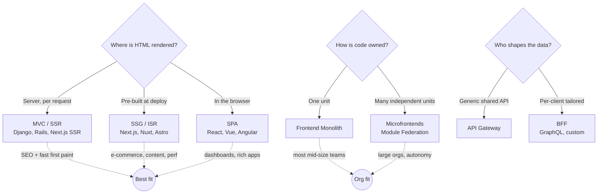

**Topic:** Frontend Architecture Patterns: Choosing Between Them
**Tags:** frontend-architecture, ssr, spa, microfrontends, bff, system-design
**Summary:** How MVC, SPA, BFF, SSG/ISR/SSR, monolith, and microfrontends differ along two axes — where HTML is rendered and how the codebase is owned — and when each is correct.

## Mental model

These six "patterns" are not six points on one scale — they answer two orthogonal questions, and conflating them is the most common junior mistake. **Axis 1: where does the HTML get built?** (server every request → MVC/SSR; pre-built → SSG; in the browser → SPA). **Axis 2: how is the frontend codebase owned and deployed?** (one unit → monolith; many independently-deployed units → microfrontends). BFF is a third, separate concern — *who shapes the data the frontend consumes*. A senior engineer reads the chart's bars (scalability, perf, complexity, team size, cost) as **second-order consequences** of those choices, and treats "Team Size" as the tell that most of these are Conway's-Law decisions disguised as tech decisions. The discipline is to add complexity only when scale or team-autonomy pain forces it — every box you fill on "complexity" and "cost" is a tax you pay forever.

## Diagram



## Prerequisites

- Client–server request/response model (what the browser actually receives on first byte)
- The difference between **rendering** (producing HTML) and **hydration** (attaching JS event handlers to server HTML)
- Why JavaScript bundle size and round-trips affect Core Web Vitals (LCP, TTI, FID/INP)
- Conway's Law: system structure mirrors org communication structure

## How it actually works

**MVC (server-rendered).** Server fetches data → fills an HTML template → ships a complete page. Every navigation is a full page rebuild + reload. Cheap, simple, SEO-trivial (HTML is complete on arrival). Ceiling: interactivity is clunky; rich app-like UX requires fighting the model. *Django, Rails, ASP.NET MVC.*

**SPA (client-rendered).** Server ships a near-empty HTML shell + a JS bundle. The browser runs the bundle, fetches data via APIs, and paints/updates the UI without full reloads. Feels "appy." Two structural weaknesses a senior must internalize: **(1) SEO** — crawlers see an empty shell unless they execute JS; **(2) first-load perf** — the user waits for download + parse + execute + data-fetch before meaningful paint. *React, Vue, Angular.*

**SSG / ISR / SSR (the modern answer to SPA's two weaknesses).** Render HTML on the server so first byte is meaningful, then hydrate to get SPA-like interactivity. The three flavors are about *when* the HTML is built:
- **SSG** — built once at deploy. Fastest, cacheable on a CDN, but stale until rebuild. Best for content that rarely changes.
- **SSR** — built per request. Fresh + personalized, but each request costs server compute and TTFB depends on your data layer.
- **ISR** — SSG that silently regenerates on a schedule/on-demand. Hybrid: CDN speed with bounded staleness.
*Next.js, Nuxt, Astro. Astro adds "islands" — ship zero JS except for interactive islands.*

**Frontend Monolith.** One repo, one build, one deploy for the whole frontend. Simple mental model, easy refactors across features, one dependency tree. Pain appears at scale: long builds, teams blocked on a shared pipeline, merge contention. The right intermediate is a **modular monolith** — enforced internal boundaries before you pay the distributed tax.

**Microfrontends.** Independent pieces (checkout, search, profile), each built/deployed by a different team, stitched at runtime (module federation) or build-time. Enables team autonomy and independent release cadence at large org scale. Costs: shared-dependency management (multiple React versions in one page), integration/contract complexity, a shell/host app, and N× the operational + observability surface.

**BFF (orthogonal — data shaping).** A per-client backend whose only job is to aggregate downstream services and return exactly what *that* client needs. Eliminates over-fetching and chatty round-trips, decisive on low-bandwidth mobile. Cost: an extra service to own, secure, and keep in sync with downstream contracts. *GraphQL is a common implementation.*

## Two examples

**Example 1 — canonical: a startup's correct evolution path.**
```text
Stage 1 (0–3 eng):    Next.js monolith. SSR for marketing/SEO pages,
                      client components for the app dashboard.
                      One repo, one deploy. Ship product, not architecture.

Stage 2 (1 web + 1 mobile client): add a BFF (or GraphQL) so the React Native
                      app and the web app each get tailored, slim payloads
                      instead of both hammering the same over-fetching REST API.

Stage 3 (4+ frontend teams blocking each other): FIRST enforce package
                      boundaries + independent CI inside the monolith.
                      ONLY if autonomy pain persists → split into microfrontends.
```

**Example 2 — wrong-but-tempting: microfrontends as a "tech upgrade".**
```text
A 6-engineer team with ONE product splits into 5 microfrontends because
"big companies do it / it's more scalable."

Result:
- 3 different React versions ship to one browser tab (bundle bloat, runtime bugs)
- a shell app nobody owns becomes the bottleneck
- end-to-end debugging now spans 5 pipelines and 5 error dashboards
- velocity DROPS — the integration tax exceeds any autonomy benefit at this size

Lesson: microfrontends solve an ORG-SCALING problem (many teams), not a
performance or "modernity" problem. With one team, the cost is all downside.
```

## Why it's written this way

The chart separates "Performance" from "Complexity"/"Cost" deliberately: the highest-performance options (SSG/SSR, BFF) are *not* free — you pay in build/runtime infrastructure and an extra layer to maintain. The "obvious-but-wrong" move is to optimize a single bar (e.g. chase microfrontends for "Scalability") without reading "Complexity," "Cost," and especially "Team Size" alongside it. SSR exists specifically because the SPA's two structural weaknesses (SEO, first paint) became business problems for content/commerce sites; it's not "better than SPA," it's a different point on the render-location axis with its own server-cost trade-off. The senior framing is **reversibility**: monolith→microfrontend and SPA→SSR are expensive to undo, so you defer them until evidence (real team-blocking, real Core Web Vitals failures) forces the move — not until the architecture "feels" outdated.

## Failure modes

- **SPA for an SEO-critical site** → content invisible to crawlers, poor LCP, lost organic traffic. (Should have been SSG/SSR.)
- **Premature microfrontends** → dependency version skew, bundle bloat, a shared shell bottleneck, slower velocity than the monolith it replaced.
- **SSR with a slow data layer** → every request blocks on backend latency; TTFB balloons. SSR moved the bottleneck, it didn't remove it. (ISR/caching or SSG may be the real answer.)
- **No BFF with multiple clients** → mobile over-fetches desktop-shaped payloads, burning bandwidth/battery; or the frontend makes 8 chatty calls per screen.
- **Treating ISR as "always fresh"** → users see stale prices/inventory between regenerations; you needed SSR for that surface.
- **Hydration mismatch** (SSR) → server HTML ≠ client's first render, causing flicker, console errors, or broken interactivity until full re-render.

## Quiz

### Q1

A marketing site built as a client-side React SPA ranks poorly on Google despite good content. What is the architectural root cause, and what is the standard fix?

**Answer:** A pure SPA ships a near-empty HTML shell; content is painted by JS after hydration. Crawlers that don't execute JS (or budget-limit it) see nothing, and Core Web Vitals (LCP) suffer from the JS round-trip. Fix: move to SSR/SSG (Next.js, etc.) so the server returns fully-rendered HTML on first byte, then hydrate. The render location, not the framework, is the lever.

### Q2

Your org has 4 frontend teams blocked on each other's deploys in one Next.js monolith. A staff engineer proposes microfrontends. What three costs must you weigh before agreeing, and what cheaper step comes first?

**Answer:** Costs: (1) shared-dependency hell — duplicate/mismatched React versions ship to the browser, bloating bundle and risking runtime errors; (2) integration & contract complexity — module federation, versioning, a shell app, and cross-team API contracts; (3) operational/observability overhead — N pipelines, N error surfaces, harder end-to-end debugging. Cheaper first step: enforce module/package boundaries and independent CI within the monolith (a "modular monolith"); only split when team-autonomy pain provably outweighs integration cost. Microfrontends are an org-scaling tool, not a tech upgrade — Conway's Law over performance.

### Q3

What problem does a BFF solve that a single shared API gateway does not, and what is the maintenance trade-off?

**Answer:** A BFF gives each client (mobile vs web) its own tailored aggregation layer: it fans out to many backend services and returns exactly the shape, fields, and payload size that client needs — critical on low-bandwidth mobile where over-fetching costs latency and battery. A shared API forces one-size-fits-all responses and chatty round-trips. Trade-off: you now own and deploy an extra per-client service (more code, more surface to secure, more to keep in sync with downstream contracts). GraphQL is one common BFF implementation.
