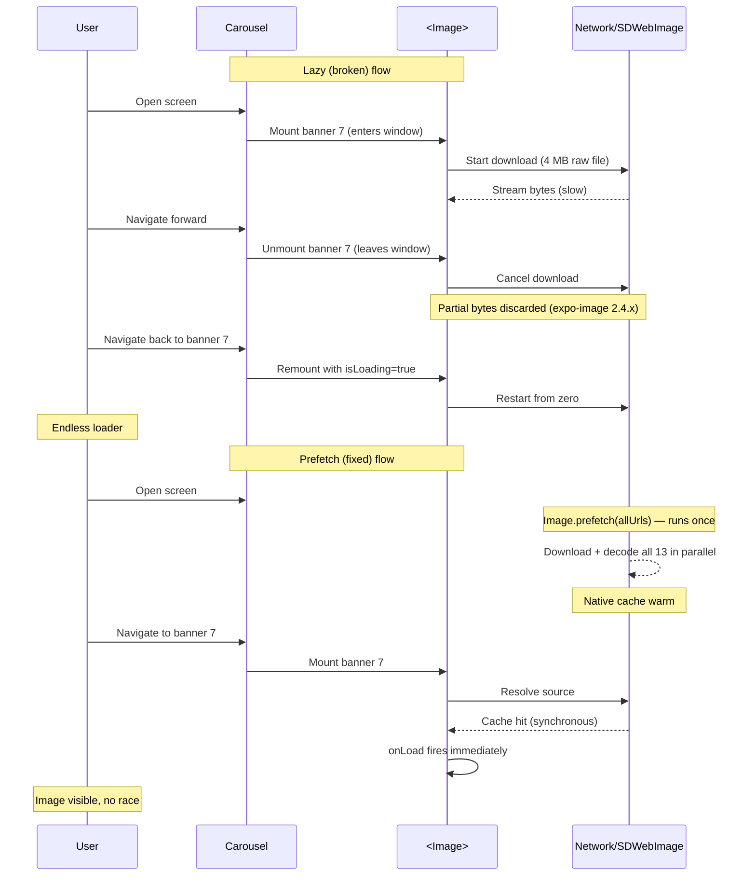

**Topic:** Why image carousels need prefetching
**Tags:** react-native, expo-image, image-loading, prefetching, carousel, virtualization
**Summary:** Lazy image downloads inside virtualizing carousels race with mount/unmount cycles; prefetching at the data layer makes loading deterministic.

## Mental model

A virtualizing carousel (like `react-native-reanimated-carousel`, or any `FlatList`/`FlashList` with `windowSize`) only keeps a small ring of items mounted at once. When you put a `<Image source={{ uri }}>` inside an item, the image **starts downloading lazily on mount**. If the carousel unmounts that item before the download completes — because the user navigated, or the parallax window slid — the download is cancelled and the bytes are discarded. The user sees a loader that never clears, even though "logically" the file should eventually finish downloading. There's no "eventually" in a virtualized list: the component that owns the request can die before the response arrives, and the response that does arrive has no one to deliver `onLoad` to.

The bug is invisible when downloads are faster than the carousel's mount/unmount cadence. It surfaces the day a campaign uploads larger assets, or the day an upstream library changes how it handles cancellation.

## Diagram



## Prerequisites

- How virtualizing carousels/lists use `windowSize` to limit mounted items.
- That `<Image>` in React Native (both core and expo-image) lazily kicks off the download on render, not at data-fetch time.
- That `onLoad` fires from native → JS via the bridge, and React state updates only happen when JS processes the callback on the *mounted* component instance.

## How it actually works

The lifecycle of a banner inside a virtualizing carousel has more failure modes than people assume:

1. **Carousel decides item is in-window.** This depends on the current scroll/index position and `windowSize`. The carousel mounts the item's component subtree.
2. **`<Image source={{ uri }}>` renders.** expo-image (SDWebImage on iOS / Glide on Android) enqueues a download for that URL. `onLoadStart` fires.
3. **Bytes stream from network.** For small assets (< 500 KB), this is hundreds of milliseconds. For multi-MB raw files, it can take seconds or tens of seconds.
4. **One of three things happens before bytes complete:**
   - The user stays on this banner → bytes complete → `onLoad` fires → React state hides the loader. Happy path.
   - The carousel cycles this item out of the window (windowSize is a hard cap) → component unmounts → expo-image cancels the request. In **expo-image 2.0.7** the partial bytes are *retained on disk* so a remount can resume cheaply. In **expo-image 2.4.x** the partial bytes are *discarded*. New behavior is more correct (no leaked downloads) but breaks code that was implicitly relying on the old leniency.
   - The native download completes but the `onLoad` event arrives at the bridge while JS is blocked (Sendbird reconnect, large synchronous work, etc.). By the time JS drains the queue, the target component may have already unmounted — `setState` on an unmounted component is a no-op. Loader stays.

5. **Cycle repeats.** The user navigates back, the item remounts with a fresh `isLoading=true`. With expo-image 2.4.x's stricter cancel, no bytes were saved, so it restarts from zero. With a heavy concurrent download from another not-yet-prefetched banner saturating the bridge, the new mount may face the same fate.

The fix is to **stop lazily downloading from inside the carousel item.** Instead, the moment the data arrives at the screen, hand the full list of URLs to `Image.prefetch()`. That kicks off all downloads in parallel on native threads, immediately, before any item is mounted. By the time the carousel mounts each banner, expo-image already has the bytes in its cache — `source` resolves synchronously, `onLoad` fires nearly immediately, and the race goes away.

## Two examples

**Example 1 — canonical (with prefetch):**

```tsx
import { Image as ExpoImage } from 'expo-image'

export const useDiscoveryData = () => {
  // ... existing data fetch ...
  const discoveryImages = useMemo(/* ... */, [discoveryLayout])

  // Warm expo-image's native cache for every banner as soon as data lands.
  // Decouples download from carousel mount timing — bytes are ready before the
  // <Image> component renders, so onLoad fires synchronously from cache.
  useEffect(() => {
    if (discoveryImages.length === 0) return
    const urls = discoveryImages
      .map((b: any) => b?.banner?.imageUrl as string | undefined)
      .filter((u): u is string => !!u)
    if (urls.length === 0) return
    ExpoImage.prefetch(urls, { cachePolicy: 'memory-disk' })
  }, [discoveryImages])

  return { discoveryImages, /* ... */ }
}
```

**Example 2 — wrong-but-tempting (lazy in the item):**

```tsx
// Inside the carousel item — this is what breaks under cycling.
// Every banner starts its own download on mount.
// Whichever banner unmounts mid-download loses its bytes.
const DiscoveryImage = ({ item }) => {
  const [isLoading, setIsLoading] = useState(true)
  return (
    <>
      {isLoading && <Loader />}
      <Image
        source={{ uri: item?.banner?.imageUrl }}
        onLoad={() => setIsLoading(false)}
        cachePolicy="memory-disk"
      />
    </>
  )
}
```

This "looks right" — declarative, self-contained, idiomatic. It fails the moment the carousel cycles items faster than the network can drain them.

## Why it's written this way

- **Why prefetch at the data layer, not the component layer.** Components are owned by the carousel and get destroyed during cycling. The data layer (a hook above the carousel) outlives the cycling. Putting the prefetch there guarantees it runs exactly once per data load, regardless of how many times items mount/unmount.
- **Why not just bump `windowSize` to N (total banner count).** Works for small lists but breaks the carousel's memory budget for large ones. It also leaves the bug latent — a future campaign with 50 banners reintroduces it. Prefetch fixes the race generally.
- **Why not migrate to React Native's core `<Image>`.** Core `Image` uses UIImage / Fresco which detect format from magic bytes (more lenient about content-type mismatches), so it works around a *different* bug (CDN serving the wrong content-type). It does not fix the lazy-download race — same lifecycle. Prefetch + expo-image is the cleaner combination.
- **Why apply CDN URL transforms (`?tr=f-webp,w-1080,q-80`) in addition to prefetch.** Prefetch ensures bytes land before the carousel mounts items. But a 5 MB raw file still pollutes the bridge with progress events and saturates the network for whatever's downloading next. Right-size the assets and prefetch becomes near-free.

## Failure modes

- **Upstream cancel-on-unmount change.** Going from expo-image 2.0.7 → 2.4.x changed partial-byte retention. Any image library upgrade can flip cancellation semantics; you usually find out only when assets get large enough to lose the race.
- **JS thread blocked during route mount.** Sendbird reconnect, Reanimated worklet setup, large synchronous reducers — any of these stall the JS thread while `onLoad` events queue at the bridge. When JS drains, the target component may have already unmounted.
- **Asset size regressions.** Banners uploaded at native camera resolution (1608×3496 = ~21 MB decoded) silently work until they don't. A size policy at the upload boundary (cap dimensions, force WebP encoding) prevents this class of bug entirely.
- **CDN content-type lies.** A `.webp` URL serving PNG bytes hangs the SDWebImage WebP coder silently (no `onError`). Affects expo-image specifically; RN core `<Image>` survives because it sniffs magic bytes. Most often caused by upload tools that force `.webp` filenames without re-encoding.
- **Parallax mode pre-mounting.** Some carousel modes pre-mount items off-screen for transition effects. expo-image may defer decode for invisible views, which interacts oddly with cycling. Hard to detect from logs.

## Quiz

### Q1

If the carousel's `windowSize` is 6 and the journey has 13 banners, why does the 7th banner's loader sometimes never clear even after waiting?

**Answer:** The carousel only keeps ~6 items mounted at once. When the user navigates and the window slides, an item that hasn't finished downloading gets unmounted. expo-image 2.4.x cancels in-flight downloads on unmount and discards the partial bytes. When the user returns to that banner, it remounts with `isLoading=true`, restarts the download from zero — and if the carousel is still cycling or the JS thread is busy processing the bridge backlog, the `onLoad` event may target an unmounted component instance and be silently dropped. The component's React state never sees `isLoading=false`, so the loader stays.

### Q2

The same code worked fine with past campaigns of 20 banners. What changed?

**Answer:** Two unwritten assumptions. (1) Past banners were ~200–500 KB, so even when cycled in/out they finished downloading inside the brief window they were mounted. (2) The previous expo-image (2.0.7) kept partial download bytes on unmount, so a banner that got cycled out at 80% complete would only need 20% on remount. The Expo 53 upgrade bumped expo-image to 2.4.x which discards partial bytes on cancel, and the new Valentine campaign banners were 4–7 MB raw — together both safety nets disappeared and the latent bug surfaced.

### Q3

Why is `Image.prefetch` at the data layer a more durable fix than increasing the carousel's `windowSize`?

**Answer:** `windowSize` is an internal carousel knob that only delays the problem — if a future campaign exceeds it, the bug returns. Prefetch decouples download from mount: bytes land in expo-image's native cache as soon as data arrives, before the carousel mounts any item. When a banner finally renders, `source` resolves from cache synchronously and `onLoad` fires immediately, regardless of how briefly the component lives or how busy the JS thread is. The fix removes the race entirely instead of widening the window for it.
