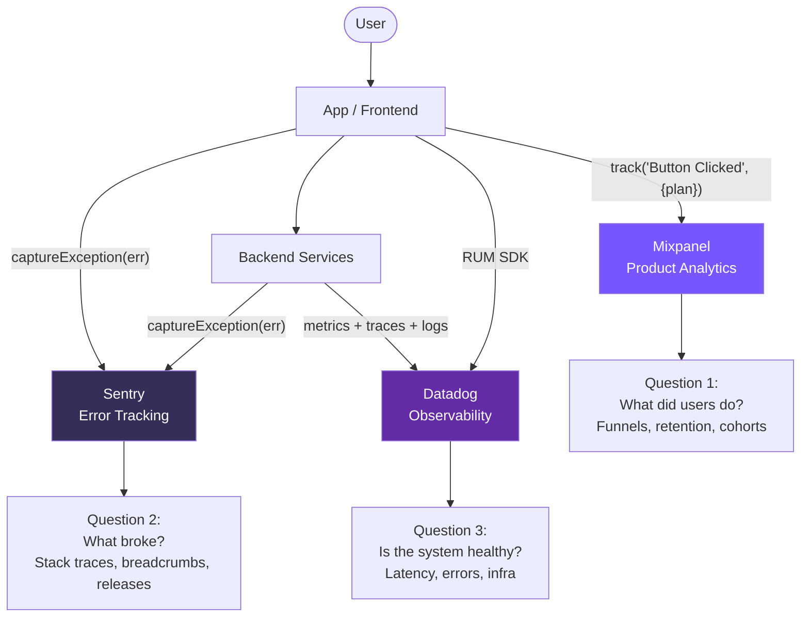

**Topic:** Mixpanel vs Sentry vs Datadog: three different observability questions
**Tags:** observability, analytics, monitoring, sentry, datadog, mixpanel, apm
**Summary:** Three monitoring tools answering three different questions about a running product — what users did, what broke, and whether the system is healthy.

## Mental model

These three tools are often discussed together but they sit in **three different product categories** and answer three different questions. Mixpanel is product analytics ("what did users do?"). Sentry is error tracking ("what broke?"). Datadog is observability ("is the system healthy?"). They overlap at the edges — Sentry has lightweight APM, Datadog has Real User Monitoring, Mixpanel has session replay — but the center of gravity of each is different. Most mature companies end up running all three, because each one's core competency is genuinely hard for the others to replicate well.

## Diagram



## Prerequisites

- Basic understanding of events, logs, metrics as data types
- Familiarity with the idea of an SDK initialized at app startup
- Concept of a stack trace (helpful for Sentry section)
- Concept of a release / version tag (helpful for Sentry release health)

## How it actually works

### Mixpanel — product analytics

1. **SDK in your app:** `mixpanel.track('Plan Viewed', { plan: 'pro', source: 'banner' })`. Events have a name + arbitrary properties.
2. **Identity stitching:** `mixpanel.identify(userId)` ties anonymous pre-login events to the logged-in user retroactively. This is what makes signup funnels work — the events from before login still belong to the right user.
3. **People properties vs event properties:** events describe *actions* (what happened); people properties describe *the user* (`plan_type`, `signup_date`, `country`). Funnels can filter by either.
4. **Funnels:** define a sequence (Plan Viewed → Clicked Subscribe → Completed Payment). Mixpanel computes drop-off at each step and lets you slice by any property.
5. **Retention:** pick a "born" event and a "return" event, get cohort retention curves (D1, D7, D30 percentages).

### Sentry — error tracking

1. **SDK init** with `release` and `environment` tags. The release tag is critical — it's how Sentry says "this bug regressed in v2.34".
2. **Auto-capture:** unhandled JS exceptions, native crashes, network errors, React error boundaries — all caught automatically once initialized.
3. **Manual capture:** `Sentry.captureException(err, { tags: { feature: 'chat' } })` for caught errors you still want logged.
4. **Source maps:** for minified bundles (web/RN), upload source maps at build time so stack traces de-minify back to real file:line.
5. **Grouping:** Sentry hashes the stack trace shape, so 10,000 occurrences of the same error collapse into one issue with an occurrence count.
6. **Breadcrumbs:** auto-recorded trail of clicks, navigations, network calls, console logs leading up to the error. Like a black-box recorder.
7. **Release health:** % of sessions that were crash-free per release. "v2.34: 95% crash-free → v2.35: 88%" → instant rollback signal.

### Datadog — observability

A platform of ~15 sub-products that share tags. The four that matter most:

- **Infrastructure metrics** (agent on each host pushes CPU/memory/disk every 15s)
- **APM / traces** (SDK wraps your service; each request gets a trace_id; spans show what took how long)
- **Logs** (forwarded with the same trace_id so you can pivot from trace → logs for that exact request)
- **RUM** (page loads, user sessions, like Sentry's breadcrumbs but for performance)

The killer feature is **tag correlation**: a metric, a log line, and a trace all share `service:checkout, env:prod, version:v2.34, trace_id:abc123`. You can pivot from a CPU spike → which service → slow traces in that service → logs from those traces, all in one tool.

## Two examples

**Example 1 — canonical: a single user signup, what each tool sees**

```text
14:30:01  User loads /pricing
          → Mixpanel:  track("Plan Viewed", {plan: "pro", source: "homepage"})
          → Datadog:   RUM page-load metric (LCP=1.2s, FCP=400ms)

14:30:45  User clicks "Subscribe"
          → Mixpanel:  track("Subscribe Clicked", {plan: "pro"})
          → Datadog:   APM trace for POST /api/checkout/init (180ms)

14:31:02  Payment succeeds
          → Mixpanel:  track("Subscription Completed", {plan: "pro", revenue: 500})
          → Mixpanel:  identify(user_id) + people.set({plan: "pro"})
          → Datadog:   APM trace for POST /api/payment (1.4s)

14:31:03  React error boundary catches a render bug on success page
          → Sentry:    captureException(error)
                       breadcrumbs: [Plan Viewed, Subscribe Clicked, Payment, Render Crash]
                       release: v2.34
                       grouping: hashed stack → "TypeError in SuccessPage:142"
```

Three tools, three lenses, same event stream.

**Example 2 — production incident: a slow API, where the investigation lives**

```text
INCIDENT: Checkout p99 latency 200ms → 3s at 14:32

Step 1 — Detection
  Datadog monitor fires: "checkout latency > 1s for 5 minutes"

Step 2 — Root cause (all in Datadog)
  → Metrics dashboard: spike correlates with /inventory/check downstream
  → Click into APM: traces for /inventory/check show 100% of time in DB query
  → Pivot to logs (same trace_id): "connection pool exhausted: max=10"
  → Infra metrics on inventory-svc: CPU pinned at 100%

Step 3 — Confirm cause
  Deploy at 14:30 changed pool size from 50 → 10 in config file. Revert.

What Sentry would have shown: nothing — no exceptions thrown.
What Mixpanel would have shown: a downstream funnel drop in "Checkout Completed", but no clue why.
```

## Why it's written this way

Each tool optimizes for a different audience and a different time horizon:

- **Mixpanel** is built for PMs, growth, marketing. Time horizon: days to months (cohort retention, A/B test readouts). The UI assumes you want sliced funnels, not log lines.
- **Sentry** is built for developers on call. Time horizon: seconds to hours (a release went bad). The UI is exception-centric: stack trace, breadcrumbs, release.
- **Datadog** is built for SRE / backend / on-call. Time horizon: seconds to minutes during an incident. The UI assumes you want to pivot across data types using shared tags.

Why not consolidate? Because each tool's core feature is genuinely hard:
- Mixpanel's funnel/retention math at scale is non-trivial. Datadog/Sentry don't try.
- Sentry's stack trace grouping + source map de-minification + release health is its own engineering problem. Datadog has APM exception tracking but it's coarser.
- Datadog's tag correlation across metrics+logs+traces requires a unified storage layer. Mixpanel/Sentry don't try.

The naive "just use Datadog for everything" or "just use Mixpanel and add error tracking" attempts usually result in second-class versions of the missing capabilities.

## Failure modes

- **Mixpanel cost explosion** — charged per tracked event. Logging every scroll or every keystroke racks up huge bills at scale. Common Swiggy-scale problem.
- **Mixpanel PII leakage** — easy to put email/phone into event properties. Redaction is opt-in. Compliance team will catch this eventually.
- **Sentry without source maps** — every error in prod looks like `bundle.js:1:55432`, useless for debugging. Half of "Sentry isn't working" complaints are missing source map upload in CI.
- **Sentry sample-rate trap** — sampling errors to save cost means missing rare crashes affecting VIP users.
- **Sentry alert noise** — without grouping discipline, every transient network timeout becomes 5,000 events and people stop reading alerts.
- **Datadog cost explosion via cardinality** — tagging traces with `user_id` or `request_id` (high-cardinality dimensions) creates millions of unique timeseries, each billable. Custom metrics bills can 10× overnight.
- **Datadog APM agent overhead** — non-zero CPU/memory cost. On hot paths it matters; benchmark before/after deploy.
- **Alert fatigue (any tool)** — easy to wire 200 monitors, hard to maintain them. Most teams end up ignoring most alerts within a year.

## Quiz

### Q1

Your PM asks: "What % of users who viewed the pricing page completed a subscription?" Which of the three tools is the right one to answer this, and why not the other two?

**Answer:** Mixpanel (or any product analytics tool — Amplitude, Databricks). Sentry only knows about errors so it can't tell you about successful flows. Datadog can show API latencies for those endpoints but doesn't natively model funnels with retention/cohort math. Mixpanel's funnel feature is built exactly for sequenced-event drop-off analysis.

### Q2

After a release, your app's crash rate spikes from 0.2% to 3%. Sentry shows 50,000 occurrences of one error grouped together. Why is the grouping critical here, and what's the next thing you should look at in Sentry to diagnose?

**Answer:** Without grouping you'd see 50,000 separate issues — impossible to triage. Sentry hashes the stack trace shape so identical errors collapse into one issue with a count. Next, look at: (1) the release tag — confirm it's only in vN+1, not vN, to confirm regression; (2) breadcrumbs on a sample event — the trail of clicks/network calls leading up to the crash will usually point at the trigger; (3) affected users count — to gauge severity.

### Q3

An API endpoint's p99 latency spiked at 3pm. You have Datadog. Walk through the pivot chain you'd use to find the root cause, naming the data types involved.

**Answer:** Start in metrics (the latency spike on the dashboard). Pivot to APM traces filtered to that service + time window — find a slow trace and look at its span breakdown to see which downstream call/DB query is slow. From the trace, pivot to logs sharing the same trace_id to see what that specific request printed (errors, retries, pool exhaustion). Optionally pivot to infrastructure metrics for the host running that service to confirm CPU/memory state. The shared tags (service, env, version, trace_id) are what makes this chain work — that's Datadog's core feature.
