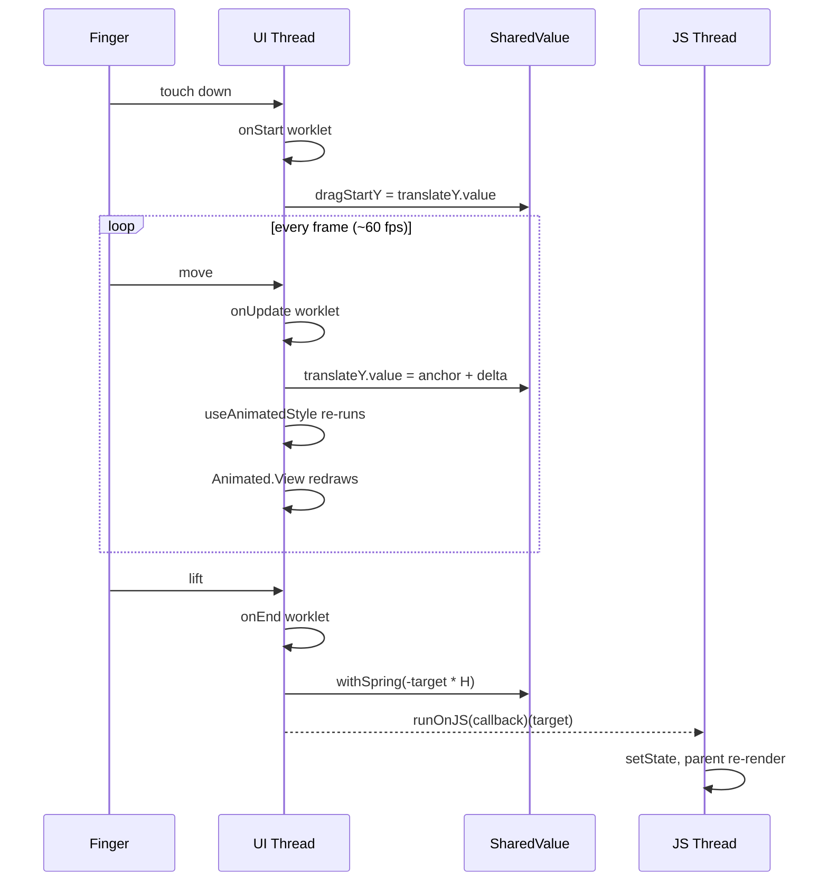

**Topic:** React Native Gesture Handling on the UI Thread
**Tags:** react-native, gestures, reanimated, gesture-handler, ui-thread, worklets
**Summary:** Why React Native gestures must run on the UI thread, the SharedValue and worklet primitives that enable it, and the single bridge crossing per gesture.

## Mental model

React Native runs your JavaScript on one thread (the JS thread) and the actual screen — pixels, touch capture, system animations — on another (the UI thread, also called "main thread"). These threads are physically separate. Every message between them, "crossing the bridge," costs time. By default, when you put your finger on the screen the OS hands the touch to the UI thread, which then ships it across the bridge to JS, which runs your `onTouchMove`, then ships the result back. That round-trip is the source of all gesture lag in stock React Native.

The fix is structural: handle the gesture entirely on the UI thread. Capture the touch there, mutate state that lives there, redraw the View from there. Cross the bridge exactly **once** per gesture — at the end, after the user lifts their finger — to tell the JS thread "the user did the thing." Two libraries cooperate to make this possible: `react-native-gesture-handler` captures touches at the native layer, and `react-native-reanimated` provides UI-thread shared state and animations. Without this discipline you can't smoothly track a finger at 60fps when JS is doing literally anything else.

## Diagram



## Prerequisites

- The JS thread vs UI (main) thread split in React Native and that they communicate via an async bridge.
- React's render cycle: `useState` triggers re-renders, callbacks identity changes per render, `useMemo` stabilizes things across renders.
- Basic 60fps math: every frame is ~16.6ms; missing frames produces visible jank.
- That a "worklet" is a JS function transpiled to run inside the UI thread's runtime — separate execution context with its own rules.
- Spring physics at the conceptual level: target value, stiffness, damping, settles over time.

## How it actually works

There are three primitives and one rule.

**SharedValue (`useSharedValue`).** A normal `useState` lives on the JS thread; the UI thread can't see it. A SharedValue is a variable in shared memory — both threads can read and write via `.value`. Reads and writes are essentially free, no bridge crossing.

```ts
const translateY = useSharedValue(0)
const activeIndex = useSharedValue(0)
const dragStartY = useSharedValue(0)
```

`translateY` is the track's vertical offset; `0` shows slide 0, `-screenHeight` shows slide 1. `activeIndex` is which slide is "the one" — used inside the worklet to know if we're at edges. `dragStartY` snapshots the position when the finger lands, because `event.translationY` reports movement *relative to that anchor*, not absolute.

**Worklet (a UI-thread function).** A regular JS function runs on the JS thread. A worklet runs on the UI thread. You mark it with `'worklet'` as the first statement, or — more commonly — by passing it to a Reanimated/gesture-handler API that auto-marks it (every callback in `Gesture.Pan().onUpdate(fn)` is auto-worklet'd).

Worklet rules:
- Can read/write SharedValues freely
- Can call other worklets
- **Cannot** access most JS-only APIs: no `fetch`, no Redux, no `setState`, no most third-party libraries
- To talk to the JS thread, use `runOnJS(jsFunc)(args)` — that's the bridge crossing, by design

**The gesture object.** `Gesture.Pan()` creates a single-finger drag tracker. The chained config tells gesture-handler when to activate and when to give up:

```ts
const panGesture = useMemo(() => Gesture.Pan()
  .activeOffsetY([-10, 10])     // wait until 10px Y movement before activating
  .failOffsetX([-15, 15])       // bail if it's a horizontal pan instead
  .onStart(() => {
    cancelAnimation(translateY)       // kill any spring still finishing
    dragStartY.value = translateY.value  // anchor for onUpdate
  })
  .onUpdate(event => {
    const idx = activeIndex.value
    const max = maxIndexSV.value
    let delta = event.translationY
    // iOS-style rubber-band at the ends
    if (idx === 0 && delta > 0)        delta *= EDGE_RESISTANCE
    else if (idx === max && delta < 0) delta *= EDGE_RESISTANCE
    translateY.value = dragStartY.value + delta
  })
  .onEnd(event => {
    const idx = activeIndex.value
    const H = screenHeightSV.value
    // Combine distance and velocity to detect intent: a fast flick should
    // commit even without much travel
    const combined = event.translationY + event.velocityY * VELOCITY_FACTOR
    const threshold = H * SNAP_THRESHOLD_RATIO

    let target = idx
    if (combined < -threshold && idx < max) target = idx + 1
    else if (combined > threshold && idx > 0) target = idx - 1

    activeIndex.value = target
    translateY.value = withSpring(-target * H, SPRING_CONFIG)
    if (target !== idx) runOnJS(callOnSwipeChange)(target)  // single bridge crossing
  })
, [/* SharedValue deps — stable */])
```

**Wiring SharedValue to the View** with `useAnimatedStyle`:

```ts
const trackStyle = useAnimatedStyle(() => ({
  transform: [{ translateY: translateY.value }],
}))

return <Animated.View style={[styles.track, trackStyle]}>{slides}</Animated.View>
```

`useAnimatedStyle` is `useMemo` whose callback is a worklet — it re-runs on the UI thread every time `translateY.value` changes, produces a fresh style object, and `Animated.View` (not regular `View`) consumes that subscription and redraws.

The rule, restated: **the drag stays on the UI thread; only `onEnd` crosses to JS, exactly once.**

## Two examples

**Example 1 — canonical RN gesture (the carousel, condensed):**

```ts
const translateY = useSharedValue(0)
const dragStartY = useSharedValue(0)

const panGesture = useMemo(() => Gesture.Pan()
  .onStart(() => {
    cancelAnimation(translateY)
    dragStartY.value = translateY.value
  })
  .onUpdate(e => {
    translateY.value = dragStartY.value + e.translationY
  })
  .onEnd(e => {
    const target = e.translationY < -100 ? -screenHeight : 0
    translateY.value = withSpring(target)
    runOnJS(setIndex)(target === 0 ? 0 : 1)
  })
, [])

const trackStyle = useAnimatedStyle(() => ({
  transform: [{ translateY: translateY.value }],
}))

<GestureDetector gesture={panGesture}>
  <Animated.View style={trackStyle}>{slides}</Animated.View>
</GestureDetector>
```

Every frame, the finger position writes a new `translateY.value`. The Animated.View redraws on the UI thread. The JS thread never wakes up. Only when the finger lifts does `runOnJS(setIndex)` ship the final index across the bridge so React state can update.

**Example 2 — wrong-but-tempting: setState inside the worklet**

```ts
// CRASHES. Looks reasonable. Doesn't work.
.onUpdate(e => {
  setSliderPosition(e.translationY)  // setState lives on JS thread
})
```

`setSliderPosition` is a JS-thread function (closes over a React `useState` setter). The worklet runs on the UI thread, where that setter doesn't exist in scope. Either you get an "undefined is not a function"-flavored crash, or — worse — silent failure where the worklet bails out partway. The fix is that you almost never want to setState during a drag at all; you want a SharedValue. If you genuinely need React state per-frame (you don't, but suppose), it'd be `runOnJS(setSliderPosition)(e.translationY)` — and now you've put a bridge crossing on every frame, which is exactly what gesture-handler+reanimated exists to avoid.

## Why it's written this way

You might think: *why not just use `PanResponder` from React Native core?* PanResponder runs every callback on the JS thread. Same bridge-crossing-per-frame problem we started with. It works for slow gestures (pinch-to-dismiss a modal) but not for finger-tracking content.

You might think: *why not use `useState` for `translateY`?* Because `useState` is JS-thread-only. The worklet running on the UI thread literally cannot read a JS-thread variable. SharedValue is the bridge — same memory, both threads, no copying.

You might think: *why memoize the gesture object?* Because gesture-handler treats the gesture object as a native-side handler installation. If its identity changes mid-drag, gesture-handler unmounts the old handler and the in-flight gesture is lost — the user's drag visibly disappears. SharedValues are stable refs, so depending on them is fine; depending on `props.onSwipeChange` (which changes identity on every parent re-render) would bust the memo every render. Hence the `onSwipeChangeRef` indirection — a stable ref the worklet can read without forcing the gesture to recreate.

You might think: *why put `runOnJS` only at `onEnd`?* Because every `runOnJS` call is a bridge crossing. Once per gesture is fine. 60 times per second is exactly what we left PanResponder to escape.

## Failure modes

- **Expensive logic in `onUpdate`.** It runs every frame on the UI thread; an O(n) loop or any allocation-heavy work will stutter. Keep it pure math on SharedValues.
- **Calling setState directly from a worklet.** Crashes. Always go through `runOnJS(setter)(value)`. And if you find yourself wanting per-frame setState, you almost certainly want a SharedValue instead.
- **Importing non-worklet-safe modules into worklet code.** No Redux selectors, no `fetch`, no most logging libraries. The worklet runtime is intentionally narrow.
- **Unstable gesture object identity.** Recreating `Gesture.Pan()` on every render — usually because you forgot `useMemo` or you depended on a callback prop directly — silently loses in-flight gestures. The drag just snaps back as if the user lifted.
- **Using `<View>` instead of `<Animated.View>`.** No subscription to SharedValue changes, so the View never moves. The drag works, the calculations work, the screen does nothing. Easy to miss in code review.

## Quiz

### Q1

Why does calling `setCurrentIndex(target)` directly inside an `onEnd` worklet crash the app, and what's the correct way to do it?

**Answer:** The worklet runs on the UI thread, which doesn't have access to React's setState mechanism — that lives on the JS thread. Calling setState directly tries to invoke a JS function from a context that doesn't have it. The correct pattern is `runOnJS(setCurrentIndex)(target)` which marshals the call across the bridge. By design this is the *only* bridge crossing in the whole gesture lifecycle, on lift, never per-frame.

### Q2

If you replace `<Animated.View style={[styles.track, trackStyle]}>` with a regular `<View>`, what visually changes during a drag?

**Answer:** The View stops moving entirely. `trackStyle` is produced by `useAnimatedStyle` and carries a reactive subscription to the SharedValue's `.value`. Only `Animated.View` from Reanimated knows how to consume that subscription and rerender on UI-thread updates. A regular View reads the style object once at render time and never sees subsequent SharedValue mutations — the gesture still runs, but the visual output is frozen.

### Q3

Why is the gesture object wrapped in `useMemo` with SharedValues as dependencies, instead of recreated on every render?

**Answer:** Because gesture-handler attaches the gesture object as a native handler. If its identity changes mid-drag (e.g. because the parent re-rendered for an unrelated state change), the system unmounts the old handler and remounts a new one — losing the in-flight gesture's tracking state and the user's drag literally disappears. SharedValues have stable identity (their `.value` mutates but the wrapper object doesn't), so depending on them keeps the memoized gesture stable. The `onSwipeChangeRef` indirection exists for the same reason: passing a live JS callback directly would force the memo to bust on every parent re-render.
