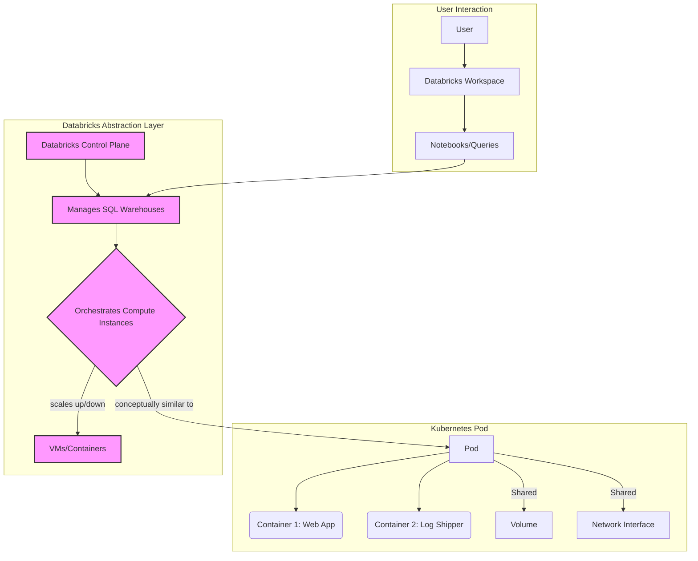

**Tags:** Databricks, Kubernetes, Cloud Computing, Data Warehousing, Containerization, Orchestration, Abstraction

**Summary:** This note clarifies the distinct roles of a Kubernetes Pod (a fundamental unit of container orchestration), a Databricks SQL Warehouse (a specialized, auto-scaling compute resource for SQL analytics), and a Databricks Workspace (the collaborative environment for interacting with Databricks). It highlights how Databricks SQL Warehouses leverage orchestration principles similar to Kubernetes for their underlying infrastructure, while abstracting away this complexity from the user.

## Mental model

These three concepts represent different layers and facets of modern cloud computing and data platforms, often operating at different levels of abstraction.

*   A **Kubernetes Pod** is the most fundamental, low-level unit for deploying containerized applications. It's like a single logical host for one or more tightly coupled containers, sharing resources.
*   A **Databricks SQL Warehouse** is a high-level, specialized, and fully managed compute resource. Think of it as a smart, auto-scaling engine specifically tuned to run SQL queries efficiently on a data lake.
*   A **Databricks Workspace** is the overarching, collaborative, web-based environment where users interact with Databricks services, including managing data, developing code, and launching compute resources like SQL Warehouses.

Crucially, while you don't directly interact with Kubernetes Pods when using a Databricks SQL Warehouse, the underlying infrastructure that powers the SQL Warehouse employs sophisticated orchestration techniques conceptually similar to how Kubernetes manages Pods to achieve auto-scaling and reliability. Databricks abstracts this complexity away, providing a managed service.

## Diagram



## How it actually works

1.  **Kubernetes Pod:**
    *   **What it is:** The smallest deployable unit in Kubernetes. A Pod encapsulates one or more containers (e.g., Docker containers), storage resources, a unique network IP, and options that govern how the containers run.
    *   **Purpose:** To run a single instance of an application or a tightly coupled group of applications that need to share resources (network, storage) and be managed as a single unit. It provides isolation and resource management for individual services.
    *   **Mechanism:** Kubernetes schedules Pods onto nodes (physical or virtual machines) in a cluster, ensuring they have the necessary CPU, memory, and network resources.

2.  **Databricks SQL Warehouse:**
    *   **What it is:** A specialized, auto-scaling compute resource within Databricks, specifically designed and optimized for running SQL queries on data in a data lake (e.g., Delta Lake). It provides an endpoint for BI tools and SQL clients.
    *   **Purpose:** To offer high performance, cost-effective, and easy-to-manage compute for analytical SQL workloads. It automatically scales up or down based on query load, and automatically stops when inactive.
    *   **Mechanism:** When you create or use a SQL Warehouse, the Databricks control plane provisions and manages the underlying compute infrastructure. This infrastructure consists of compute instances (which could be virtual machines or containers). Databricks' internal orchestrator dynamically adds more of these compute instances when query load increases (similar to a Kubernetes Horizontal Pod Autoscaler adding more Pods to a Deployment) and scales them down when load subsides. This entire process, from provisioning to lifecycle management and resource allocation, employs principles conceptually similar to how Kubernetes manages Pods, ensuring the necessary CPU, memory, and network are available. However, this orchestration is entirely managed by Databricks, and users do not directly interact with or manage these underlying instances or containers.

3.  **Databricks Workspace:**
    *   **What it is:** A web-based, collaborative environment that serves as the central hub for all Databricks activities.
    *   **Purpose:** To provide a unified platform for data engineers, data scientists, and data analysts to manage data, develop code (e.g., using notebooks in Python, Scala, R, SQL), run jobs, and interact with various compute resources (like SQL Warehouses or general-purpose clusters). It includes features for version control, access control, and collaboration.
    *   **Mechanism:** Users log into the Workspace, create notebooks, define jobs, configure clusters, and launch SQL Warehouses. The Workspace provides the UI and APIs to interact with the Databricks control plane, which then orchestrates the underlying cloud resources.

## Two examples

1.  **Kubernetes Pod Example:**
    Imagine you have a web application that serves API requests and a separate logging agent that collects logs from that web application. Instead of deploying them as separate containers, you can deploy them together in a single Kubernetes Pod.
    ```yaml
    apiVersion: v1
    kind: Pod
    metadata:
      name: my-web-app-pod
    spec:
      containers:
      - name: web-app-container
        image: my-web-app:1.0
        ports:
        - containerPort: 80
      - name: log-shipper-container
        image: fluentd:latest
        volumeMounts:
        - name: var-log
          mountPath: /var/log
      volumes:
      - name: var-log
        emptyDir: {} # Shared volume for logs
    ```
    In this Pod, both `web-app-container` and `log-shipper-container` share the same network namespace (localhost can be used for communication) and a shared `var-log` volume, ensuring they run together and can easily exchange data.

2.  **Databricks SQL Warehouse and Workspace Example:**
    A data analyst logs into their **Databricks Workspace**. From the Workspace UI, they navigate to "SQL Warehouses" and create a "Pro" SQL Warehouse named `sales_analytics_wh`. They then open a new SQL notebook in the Workspace and execute a complex query:
    ```sql
    SELECT
      customer_segment,
      SUM(sales_amount) AS total_sales,
      COUNT(DISTINCT order_id) AS distinct_orders
    FROM
      sales_data.silver.orders
    WHERE
      order_date >= '2023-01-01'
    GROUP BY
      customer_segment
    ORDER BY
      total_sales DESC;
    ```
    When this query runs, the **Databricks SQL Warehouse** automatically provisions and scales compute instances (potentially multiple virtual machines or containers) to handle the query's processing load. If many analysts run complex queries concurrently, the SQL Warehouse scales up by adding more compute resources. Once the queries complete and the warehouse becomes idle, it automatically scales down and eventually stops to save costs, all managed by Databricks' internal orchestration, abstracting away the low-level compute management.

## Why

*   **Kubernetes Pods:** Provide a robust, standardized way to deploy, manage, and scale containerized applications. They ensure that tightly coupled processes run together with shared resources, simplifying application management in a microservices architecture.
*   **Databricks SQL Warehouses:** Offer a highly optimized, fully managed solution for SQL analytics. By abstracting away the underlying infrastructure and leveraging auto-scaling, they allow users to focus on data analysis and business insights rather than managing compute resources. The use of Kubernetes-like orchestration principles internally ensures high availability, elasticity, and efficient resource utilization without burdening the user with the complexity.
*   **Databricks Workspaces:** Create a unified, collaborative, and secure environment for all data professionals. They streamline the development lifecycle, from data ingestion and transformation to machine learning and analytics, fostering teamwork and governance across data projects.

## Failure modes

*   **Kubernetes Pod:**
    *   **Resource Starvation:** If a Pod doesn't have enough CPU or memory requested, it can be throttled or evicted, leading to application performance degradation or crashes.
    *   **Container Crash Loop:** One or more containers within the Pod repeatedly fail and restart, indicating an issue with the application itself or its configuration.
    *   **Network/Volume Issues:** Misconfigured network policies or persistent volume claims can prevent the Pod from communicating or accessing data.
*   **Databricks SQL Warehouse:**
    *   **Query Performance Bottlenecks:** While auto-scaling helps, extremely complex or inefficient queries can still take a long time or exceed available resources, even with a large warehouse.
    *   **Cost Overruns:** If not properly configured (e.g., too large for typical workload, or not set to auto-stop), a SQL Warehouse can incur higher-than-expected cloud costs.
    *   **Connectivity Issues:** Problems with network configuration or firewall rules can prevent BI tools or users from connecting to the SQL Warehouse endpoint.
*   **Databricks Workspace:**
    *   **Access Control Misconfigurations:** Incorrectly set permissions can lead to unauthorized access to data or compute resources, or prevent legitimate users from performing their tasks.
    *   **Collaboration Conflicts:** Without proper version control and branching strategies for notebooks, multiple users working on the same code can lead to overwrites or merge conflicts.
    *   **Resource Exhaustion:** While Databricks manages the underlying cloud resources, a Workspace itself can hit limits if too many concurrent operations or large jobs are initiated without sufficient planning.

## Quiz

1.  What is the primary benefit of deploying multiple containers within a single Kubernetes Pod?
2.  Explain how a Databricks SQL Warehouse leverages "Kubernetes-like orchestration principles" even though users don't directly interact with Pods.
3.  If a Databricks SQL Warehouse is experiencing high query load, what action does Databricks' internal system take, and what is the benefit to the user?
4.  Which of the three concepts provides the overarching collaborative environment for data professionals?
5.  What is a potential failure mode for a Kubernetes Pod related to resource allocation, and how might it manifest?
