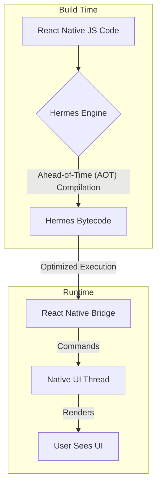

## Mental model
Imagine your React Native app's JavaScript code as a set of instructions. For these instructions to actually do anything on your phone, they need to be translated and executed by a special program called a JavaScript engine. Hermes is like a highly specialized, super-efficient translator specifically designed for mobile devices running React Native. Its main job is to make your app start faster, use less memory, and have a smaller overall size, by compiling your JavaScript code into a more optimized format *before* the app even launches.

## Diagram


## Prerequisites
*   **JavaScript:** Fundamental understanding of the language.
*   **React Native:** How it allows writing mobile apps with JavaScript.
*   **JavaScript Engines:** The basic concept that browsers/runtimes need an engine (like V8, SpiderMonkey) to execute JavaScript.
*   **Compilation (JIT vs AOT):** Awareness of Just-In-Time (JIT) and Ahead-of-Time (AOT) compilation paradigms.

## How it actually works
Hermes is a JavaScript engine developed by Meta (formerly Facebook) specifically for React Native. Its core goal is to improve the performance characteristics of React Native applications on mobile devices. Here's a breakdown of its key mechanisms:

1.  **Ahead-of-Time (AOT) Compilation:** Unlike traditional JavaScript engines that often use Just-In-Time (JIT) compilation (where code is compiled during runtime), Hermes compiles your JavaScript code into a highly optimized bytecode *at build time*.
    *   **During the build process:** When you build your React Native app, Hermes takes all your JavaScript code.
    *   **`hermesc`:** It uses a tool called `hermesc` to compile this JavaScript into a compact, efficient bytecode format.
    *   **Why it's important:** This means that when your app starts, the engine doesn't need to spend time parsing and compiling raw JavaScript. It can jump straight into executing the pre-compiled bytecode, leading to significantly faster app startup times.

2.  **Optimized Bytecode:** The bytecode generated by Hermes is specifically designed for efficient execution on mobile hardware.
    *   **Reduced size:** The bytecode is often smaller than the original JavaScript, contributing to a smaller app bundle size.
    *   **Faster loading:** Since it's pre-parsed and optimized, the engine can load and execute it more quickly.

3.  **Garbage Collection (GC) Optimization:** Hermes features a specialized garbage collector that is optimized for mobile memory constraints.
    *   **Generational GC:** It uses a generational garbage collector, which is efficient at identifying and reclaiming short-lived objects quickly.
    *   **Concurrent GC:** The garbage collector can often run concurrently with JavaScript execution, reducing pauses (jank) that might otherwise occur if the main thread had to stop to collect garbage. This helps maintain a smoother user experience, especially important for animations or frequent UI updates, as discussed in [[react-native-gestures-on-the-ui-thread]].

4.  **Memory Usage Reduction:** By optimizing its internal data structures and bytecode representation, Hermes significantly reduces the memory footprint of React Native apps. This is crucial for lower-end devices and for overall app stability, helping to prevent issues like those described in [[memory-leaks-in-react-redux-and-zustand-summary]].

5.  **Integration with Expo:** For Expo users, enabling Hermes is typically a simple configuration change in `app.json` or `app.config.js` (e.g., `jsEngine: "hermes"`). Expo CLI handles the underlying build-time compilation and integration with the native project.

## Two examples
### Example 1 — canonical: Enabling Hermes in an Expo project
Let's say you have a basic Expo React Native project. To enable Hermes, you modify your `app.json` (or `app.config.js`):

```json
// app.json
{
  "expo": {
    "name": "MyHermesApp",
    "slug": "my-hermes-app",
    "version": "1.0.0",
    "orientation": "portrait",
    "jsEngine": "hermes", // This line enables Hermes
    "ios": {
      "supportsTablet": true
    },
    "android": {
      "adaptiveIcon": {
        "foregroundImage": "./assets/adaptive-icon.png",
        "backgroundColor": "#FFFFFF"
      }
    },
    "web": {
      "favicon": "./assets/favicon.png"
    }
  }
}
```
After adding `jsEngine: "hermes"`, you would run `expo prebuild` (if you're in a bare workflow) or just `expo run:ios`/`expo run:android` (if you're in a managed workflow) to rebuild your native app. The build process will then use Hermes to compile your JavaScript into bytecode, resulting in a faster-starting and more memory-efficient app. You can verify Hermes is running at runtime by checking `global.HermesInternal` in your app.

### Example 2 — wrong-but-tempting / edge case: Node.js specific APIs
Hermes is a JavaScript engine, but it's *not* Node.js. It's designed for client-side mobile execution. Trying to use Node.js-specific global objects or modules will fail.

```javascript
// App.js
import React, { useEffect, useState } from 'react';
import { View, Text, StyleSheet } from 'react-native';

export default function App() {
  const [data, setData] = useState(null);

  useEffect(() => {
    // This will FAIL if you try to run it in Hermes,
    // because 'fs' (File System) is a Node.js core module, not available on mobile.
    try {
      const fs = require('fs');
      const fileContent = fs.readFileSync('/path/to/some/file.txt', 'utf8');
      setData(fileContent);
    } catch (e) {
      setData(`Error: ${e.message}. 'fs' module is not available in Hermes.`);
    }
  }, []);

  return (
    <View style={styles.container}>
      <Text style={styles.text}>
        {data || "Attempting to load data..."}
      </Text>
    </View>
  );
}

const styles = StyleSheet.create({
  container: {
    flex: 1,
    justifyContent: 'center',
    alignItems: 'center',
    padding: 20,
  },
  text: {
    fontSize: 18,
    textAlign: 'center',
  },
});
```
**Why it's wrong:** Hermes provides a JavaScript execution environment, but it does *not* include Node.js's extensive set of built-in modules (like `fs`, `path`, `http` server, etc.). These modules are specific to the Node.js runtime environment, which is typically used for server-side or command-line applications. React Native apps (and thus Hermes) run in a mobile client environment, which has different APIs for file system access, networking, etc.

## Why it's written this way
Hermes was developed to address specific performance bottlenecks in React Native applications, primarily related to startup time, memory consumption, and app size.

*   **Alternatives:** Before Hermes, React Native typically used JavaScriptCore (JSC), the same engine found in Safari. While JSC is a capable engine, it was not specifically optimized for the constraints of mobile applications (limited memory, battery life, need for fast cold starts). Other engines like V8 (used in Chrome and Node.js) are powerful but often larger and more resource-intensive, making them less suitable for mobile.
*   **Trade-offs:**
    *   **Pros:** Significant improvements in startup time (often 2-3x faster), reduced memory usage (up to 30% less), and smaller app bundles. It can lead to a smoother user experience, especially on lower-end devices.
    *   **Cons:** Historically, Hermes had less developer tooling support (e.g., advanced debugging features were not as mature as in V8 or JSC). While this has improved significantly, some niche debugging scenarios might still be more straightforward with other engines. It also means an extra compilation step during the build process, which can slightly increase build times, though the runtime benefits usually outweigh this. It also does not support all JavaScript features immediately upon release (e.g., specific ECMAScript proposals might take time to be implemented).

## Failure modes
1.  **Build Failures due to Hermes Version Mismatch:** If your React Native or Expo version is incompatible with the Hermes version being used, you might encounter build errors. Always check the official documentation for compatible versions.
2.  **Debugging Limitations (Historical):** While much improved, older versions of Hermes had less robust debugging tools compared to Chrome DevTools for V8. You might find certain advanced debugging features (like profiling very specific GC behaviors) to be different or less detailed.
3.  **Missing Global Objects/APIs:** As seen in Example 2, trying to use Node.js-specific APIs (like `fs`, `process`, `Buffer`) will result in runtime errors because Hermes is a client-side engine and does not provide these.
4.  **Increased Build Time:** While runtime is faster, the AOT compilation step can add a few seconds to your build process, especially for large projects or on slower machines. This is a trade-off for faster app startup.
5.  **Native Module Compatibility Issues:** Rarely, a native module might make assumptions about the underlying JavaScript engine (e.g., expecting specific behaviors of JSC's JIT compiler or its C++ API). While uncommon, this could lead to subtle bugs if not thoroughly tested with Hermes.

## Quiz
### Q1
Consider a React Native app that takes 5 seconds to launch on a mid-range Android phone when using JSC. If you switch to Hermes, what's the most likely impact on its startup time and why?
**Answer:** The startup time would most likely decrease significantly, potentially to 2-3 seconds. This is because Hermes uses Ahead-of-Time (AOT) compilation, meaning the JavaScript code is pre-compiled into optimized bytecode during the app's build process. At runtime, the engine doesn't need to parse and compile raw JavaScript, allowing it to execute the pre-optimized bytecode much faster.

### Q2
Why is it generally a bad idea to try and use `require('crypto')` directly in a React Native app running with Hermes, even though `crypto` is a standard module in Node.js?
**Answer:** The `crypto` module is a core Node.js module that provides cryptographic functionalities. Hermes is a JavaScript engine designed for client-side mobile environments, not the Node.js server-side runtime. It does not include Node.js's extensive set of built-in modules. Attempting to `require('crypto')` will result in a runtime error because the module simply does not exist in the Hermes environment. Mobile apps typically use platform-specific native APIs or third-party libraries for cryptography.

### Q3
If a React Native app experiences frequent, noticeable "jank" (stuttering) during complex animations, how might enabling Hermes potentially help, and what specific feature of Hermes would be most relevant?
**Answer:** Enabling Hermes could help reduce jank during complex animations primarily due to its optimized and often concurrent garbage collector. Jank often occurs when the JavaScript thread pauses to perform garbage collection, blocking other operations like animation updates. Hermes's generational and concurrent GC is designed to minimize these pauses, allowing JavaScript execution (and thus animation logic) to run more smoothly and consistently, even while memory is being reclaimed.

## Links
- **Related:** [[react-native-gestures-on-the-ui-thread]] — Hermes's performance on the JS thread directly impacts how quickly gesture events are processed and sent to the UI thread.
- **Related:** [[expo-image-virtualization-regression-carousel]] — Performance optimizations like Hermes are crucial for smooth UI experiences, especially in performance-sensitive components like virtualized lists or carousels.
- **Related:** [[memory-leaks-in-react-redux-and-zustand-summary]] — Hermes's optimized garbage collection directly addresses memory management, which can mitigate the impact of certain memory leak scenarios.
