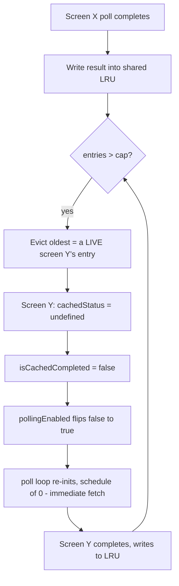

**Topic:** Infinite polling storm from evictable-cache correctness signal
**Tags:** caching, lru, polling, state-management, react
**Summary:** An endless API-call cascade caused by deriving a poll-or-stop correctness signal from a memory-bounded LRU cache that evicts live entries.

## Mental model

A polling screen keeps asking the server "done yet?" and must **stop when it sees done**. The trap: if the "am I done?" answer is read from a *shared, size-capped cache* (an LRU that throws out the oldest entry to stay under a memory limit), then a routine memory eviction can silently erase the "done" flag. The screen then concludes it isn't done and resumes polling. When several live screens share one undersized cache, each one's poll evicts another's entry, and they take turns re-polling forever. The bug isn't in the cache, the server, or the polling loop individually — it's that a **correctness signal was stored in a place designed to delete things for memory reasons.**

## Diagram



## Prerequisites

- **Polling**: repeatedly calling an endpoint until a terminal status, then stopping.
- **LRU cache**: fixed-capacity store keyed by id; on overflow it evicts the least-recently-used entry.
- **Navigation stack**: pushed screens stay mounted (and keep running effects) underneath the visible one.
- **React effect re-runs**: an effect with deps `[enabled, key]` tears down and re-runs whenever a dep changes; a re-run can re-trigger work immediately.

## Symptoms

- `POST /api/v1/hotels/listing` firing continuously, ~450ms apart, never terminating.
- The screen visibly "danced" — flickering between the results list and the loading state.
- Battery/data drain on device; a constant useless request load on the server.
- Every server response was a correct `COMPLETED` — nothing looked wrong server-side.

## Initial hypothesis (wrong)

First guess: the **backend was alternating** between `IN_PROGRESS` and `COMPLETED`, so the client legitimately kept polling. Instrumentation killed this: every logged response was `completed: true`. The real tell was a debug field showing the **request key cycling through ~6 different ids** — pointing at multiple live consumers, not a flaky server.

## Investigation path

1. Logged the poll-effect inputs and every fetch result. Saw 6 distinct search ids rotating, all `COMPLETED`.
2. Noticed each id flickering `status: COMPLETED → undefined → COMPLETED`. `undefined` means the entry was **evicted** from the shared store.
3. Found the cache cap was **5**, but **6 screens were mounted** simultaneously → permanently one over capacity.
4. Traced why eviction caused a *fetch*: the stop-condition `pollingEnabled` is derived from `isCachedCompleted`, which reads the **evictable** entry. Eviction → flips it back on.
5. Traced why 6 screens existed: editing a search mints a new id and **stacks a new screen without unmounting the old one** (`push` then `replace` only swaps the top screen).

## Root cause

Two individually-reasonable decisions collided:

- **Navigation:** each search edit left its previous screen mounted → N live screens grew past the cache cap.
- **State:** `pollingEnabled` (a *correctness* signal) was computed from an entry in a *memory-eviction* store. So normal LRU eviction was misread as "not finished," re-enabling polling, whose write evicted the next live screen — a self-sustaining cascade. The ~450ms cadence came from the poll loop being **re-initialized** (immediate `schedule(0)`) rather than waiting its 1500ms interval.

## Fix

- **Immediate (decouple the signal):** give each screen a private latch (a `ref`) recording "I have already completed *this* search." Add it to the gate: `pollingEnabled = ... && !alreadyResolved`. Now eviction can flip `isCachedCompleted` to false, but `alreadyResolved` stays true, so the screen refuses to re-poll. The displayed data lives in a different store, so losing the evictable bookkeeping entry costs nothing visible.
- **Root (remove the unbounded consumers):** a new search iteration should *replace* the previous listing screen instead of stacking it, so there is ~1 live consumer per session and the cache never overflows.

## Two examples

**Example 1 — the buggy gate (correctness read from evictable cache):**
```ts
const cachedStatus      = entry?.searchProgress?.status        // evictable!
const isCachedCompleted = cachedStatus === 'COMPLETED'
const pollingEnabled    = !isHydrating && !isCachedCompleted && !isSearchExpired
// eviction → cachedStatus undefined → isCachedCompleted false → pollingEnabled true → re-poll
```

**Example 2 — the latch (correctness in eviction-proof per-instance state):**
```ts
const resolvedRef = useRef<string | null>(null)            // private to this screen
const alreadyResolved = resolvedRef.current === restartKey
const pollingEnabled =
  !isHydrating && !isCachedCompleted && !isSearchExpired && !alreadyResolved
// on completion: resolvedRef.current = restartKey
// on identity change: resolvedRef.current = null
```

## Why it's written this way

A `ref` (not the shared store) is used deliberately: "this screen already finished" is a fact local to a mounted screen; putting it back in the shared, evictable store would just recreate the bug. Raising the cap was rejected — it only postpones the overflow until more screens stack. The clean separation is: **caches may evict for memory; correctness/stop-conditions must live somewhere eviction can't reach.**

## Failure modes (the general anti-pattern, beyond this incident)

- Deriving "should I keep working?" from a cache that can drop entries → work restarts on eviction.
- More live consumers than a shared fixed-size cache has slots → permanent eviction churn.
- An effect keyed on a flag that toggles under you → silent teardown/re-init loops with immediate re-fetch.
- Misreading a client-side feedback loop as a server problem because the request logs look like a rogue client (they were).

## Quiz

### Q1

The backend returned COMPLETED on every single response, yet the client never stopped calling the API. How is that possible?

**Answer:** Because the client decided "am I done?" by reading an entry from a shared LRU cache that is allowed to evict for memory. When another screen's write evicted this screen's entry, its cached status read as undefined → isCachedCompleted false → pollingEnabled true → it re-polled. The server's correctness was irrelevant; the client's stop-condition lived in an evictable place.

### Q2

Why did the calls fire ~450ms back-to-back instead of respecting the normal 1500ms poll interval?

**Answer:** The 1500ms is the delay between ticks of a *running* loop. Here the loop wasn't ticking — it was being torn down and re-initialized every time `enabled` flipped true (its effect deps are [enabled, restartKey]). A fresh init calls schedule(0), which fires immediately. So ~450ms is just the network round-trip, with no wait in between.

### Q3

Why is "just raise the LRU cap" not the real fix, and what is the underlying principle?

**Answer:** Raising the cap only delays the problem until more screens stack past the new cap — it doesn't address the cause. The underlying flaw is storing a correctness signal (has this finished?) in a store whose job is memory eviction. The fix is to decouple them: keep completion in per-instance state a cache can't touch, and separately stop creating unbounded live consumers.
