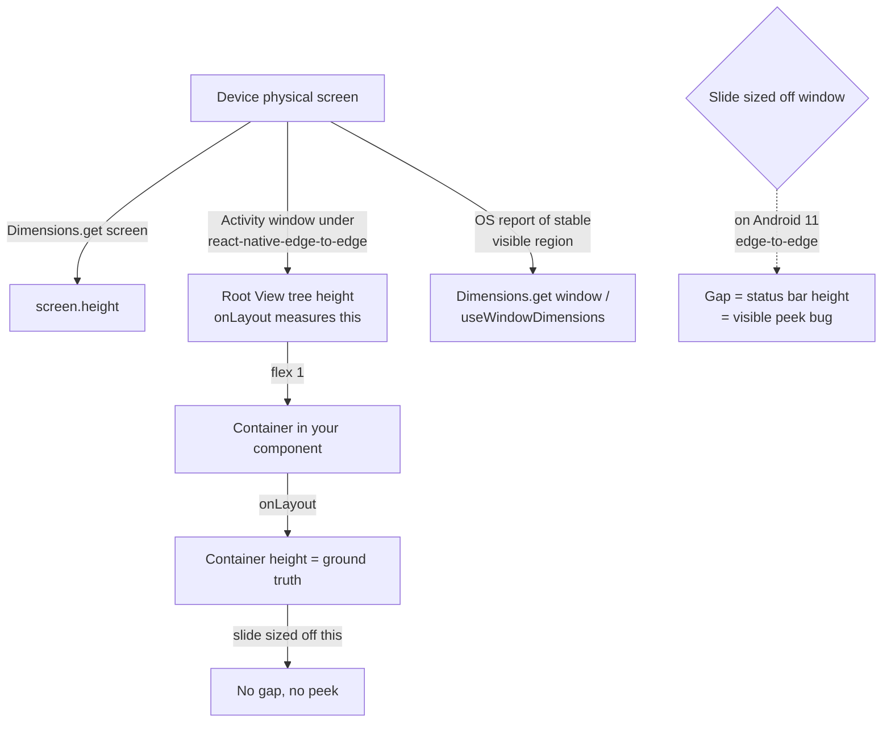

**Topic:** React Native dimension sources: window vs screen vs onLayout
**Tags:** react-native, layout, android, edge-to-edge, dimensions-api
**Summary:** Three RN dimension sources answer three different questions; mismatches cause layout bugs on Android edge-to-edge.

## Mental model

React Native gives three ways to ask "how big is the screen?" and each answers a different question. `useWindowDimensions()` and `Dimensions.get('window')` report the OS's notion of the visible content area for the app. `Dimensions.get('screen')` reports the device's full physical screen, regardless of system chrome. The `onLayout` callback reports the View's actually-rendered height after Yoga lays it out. These three values **can disagree**, and the bug comes from assuming they are interchangeable. The disagreement is most common on Android with `react-native-edge-to-edge` enabled: the activity window stretches to fill the full physical screen (so the root View renders at full-screen height), but older Android versions still report `window` as the smaller "stable visible region" excluding the status bar. Sizing children based on `window` while they live inside a container sized by Yoga produces a gap exactly the size of the status bar.

## Diagram



## Prerequisites

- React Native flexbox layout (specifically `flex: 1` + `overflow: 'hidden'`)
- Android system bars: status bar, navigation bar, and the difference between **opaque** and **transparent** chrome
- The `react-native-edge-to-edge` library's effect: makes system bars transparent and lets app content draw underneath them
- `useWindowDimensions` as a reactive hook vs `Dimensions.get('window' | 'screen')` as a one-time read

## How it actually works

**1. The three sources, restated:**

- `useWindowDimensions()` and `Dimensions.get('window')` ask the OS: "what region of the screen do I tell the app to draw in?" This is the *stable visible region* on Android — historically the area NOT covered by opaque system bars.
- `Dimensions.get('screen')` asks: "how big is the actual device screen, ignoring any chrome?"
- The `onLayout` callback fires after Yoga has laid out a View and reports its actually-rendered width and height. Ground truth, by definition.

**2. The Android edge-to-edge interaction:**

With `react-native-edge-to-edge` installed:

- The status bar and nav bar become **transparent**.
- The activity window is **extended** to cover the full physical screen.
- A `flex: 1` root View therefore renders at the full physical screen size, drawing *under* the (now transparent) status bar.

On Android API 36+, the window-metrics provider was updated: `Dimensions.get('window')` reports the full extended window (matches the rendered container).

On Android API 30 (Android 11), the window-metrics provider still reports the legacy stable visible region — `window` excludes the status bar height. So `useWindowDimensions().height` is less than the actual rendered container height by exactly `statusBarHeight`.

On iOS, this divergence doesn't happen — `window` already equals the View tree height.

**3. Why this manifests as a "peek":**

Imagine a vertical carousel. Each slide is positioned absolutely at `top: index * slideHeight` with `height: slideHeight`. The parent container has `overflow: 'hidden'` to clip everything outside.

If `slideHeight` is sourced from `useWindowDimensions().height` (= 764 on the buggy device) but the container is `flex: 1` (= 800, the physical screen), then:

```
container clips at y = 800
slide 0   → y = [0, 764]
slide 1   → y = [764, 1528]
```

The 36 pixels from y=764 to y=800 inside the container reveal the **top edge of slide 1**. That is the user-visible peek. Its size is exactly `containerHeight - slideHeight` = `containerHeight - windowHeight` = the status bar height.

**4. Why both fixes work:**

Switching slides to size off `Dimensions.get('screen')` works because, when the container fills the physical screen, `screen.height === container.height` by construction. Switching to `onLayout`-measured container height works because it is ground truth — measured after Yoga finishes. In every device config measured (iOS, Android API 30, Android API 36), `screen.height === container.height`, so the two fixes converge.

## Two examples

**Example 1 — canonical (the buggy pattern, do not copy):**

```tsx
import { useWindowDimensions, View } from 'react-native'

function VerticalCarousel({ slides }) {
  const { width, height } = useWindowDimensions()  // ← the trap on Android edge-to-edge

  return (
    <View style={{ flex: 1, overflow: 'hidden' }}>
      {slides.map((s, i) => (
        <View
          key={s.id}
          style={{
            position: 'absolute',
            top: i * height,     // assumes height == container height
            width,
            height,              // sized off `window`, not container
          }}
        >
          <Slide data={s} />
        </View>
      ))}
    </View>
  )
}
```

On Android 11 + edge-to-edge: `height = 764`, container clips at 800 → 36px of next slide leaks at the bottom.

**Example 2 — fix using `onLayout`-measured container (strictly correct):**

```tsx
function VerticalCarousel({ slides }) {
  const [size, setSize] = useState(() => {
    const s = Dimensions.get('screen')                 // safe initial estimate
    return { width: s.width, height: s.height }
  })

  return (
    <View
      style={{ flex: 1, overflow: 'hidden' }}
      onLayout={e => {
        const { width, height } = e.nativeEvent.layout
        setSize(prev =>
          prev.width === width && prev.height === height ? prev : { width, height },
        )
      }}
    >
      {slides.map((s, i) => (
        <View
          key={s.id}
          style={{
            position: 'absolute',
            top: i * size.height,
            width: size.width,
            height: size.height,
          }}
        >
          <Slide data={s} />
        </View>
      ))}
    </View>
  )
}
```

A simpler alternative is `Dimensions.get('screen')` read once via `useMemo` — same result whenever the container is the device root (no chrome eating layout space).

## Why it's written this way

- `Dimensions.get('screen')` is the simpler fix and works whenever the container is the device root. One-time read, doesn't depend on Yoga, no re-render cost.
- `onLayout`-measured is strictly more correct because it captures ground truth without assumptions about container size. It handles split-screen and multi-window on Android, where `screen` would be wrong (reports full physical device, but the app got half).
- `useWindowDimensions` is **not** wrong as an API — it's just answering the wrong question for layout sizing. It is correct for analytics that need to know what the OS thinks the user's effective viewport is.
- Initial `size = Dimensions.get('screen')` in the `onLayout` version avoids a blank first frame: carousel renders at the right size immediately, `onLayout` confirms, and the equality guard skips the re-render when measured == estimate.

## Failure modes

- **Sizing flex children off `useWindowDimensions()` on any RN app with edge-to-edge.** The gap is invisible on iOS and modern Android, lurks on older Android versions, and is exactly the status bar height when it appears.
- **Trusting `Dimensions.get('screen')` when the container does not fill the screen.** Multi-window mode, split-screen, or containers with sibling chrome (a tab bar, a fixed header) all break this assumption. Use `onLayout` in those cases.
- **Conflating "device affected" with "rendering broken."** A device where `window ≠ container` has the *potential* for the bug, but if you sized off `screen` or `onLayout`, rendering is fine. Track these as two separate analytics signals — a device marker (window vs container, was this device ever affected?) and a health signal (applied-slide vs container, is the slide actually rendering with a gap?). They diverge post-fix and conflating them produces false alarms.
- **Not testing layout-sensitive features on Android API 30 edge-to-edge.** iOS hides this class of bug because its window equals the container. Coverage requires the specific OS versions where the divergence still exists.

## Quiz

### Q1

A carousel slide inside a `flex:1` container is sized off `useWindowDimensions().height`. On a device where window reports `360x764` but the View tree actually renders at `360x800` (full physical screen), what visual bug appears and how big is it?

**Answer:** The next slide peeks at the bottom of the current slide by **36 pixels** — exactly the difference (800 − 764). Slide 0 fills y=[0, 764]; the container clips at y=800; the 36px gap from y=764 to y=800 reveals the top of slide 1. The peek size always equals the status bar height because that is the amount by which `window` is short of the rendered container.

### Q2

iOS apps with the same carousel code don't show the peek. Why?

**Answer:** On iOS, `useWindowDimensions()` / `Dimensions.get('window')` already equals the View tree height — iOS does not subtract the status bar from `window` the way older Android does. So `window === container`, slides match the container, and there is no gap. Android API 36+ also matches because Google fixed the window-metrics provider to report the full edge-to-edge window. The bug is specific to Android versions that still report the legacy stable visible region while edge-to-edge extends the actual rendered window.

### Q3

Your container is `flex:1` inside a screen with edge-to-edge, and you need children sized to match it exactly. Which dimension source should you use, and why not `useWindowDimensions`?

**Answer:** Either `onLayout` (ground truth — measures the actually-rendered View, also correct under split-screen / multi-window) or `Dimensions.get('screen')` (the full physical screen, which equals the container when the container fills the screen). `useWindowDimensions` reports the OS's notion of the visible area, not the actual rendered size — under edge-to-edge it can be smaller than the container by the status bar height, producing a gap exactly the size of the chrome the View is now drawing under.
