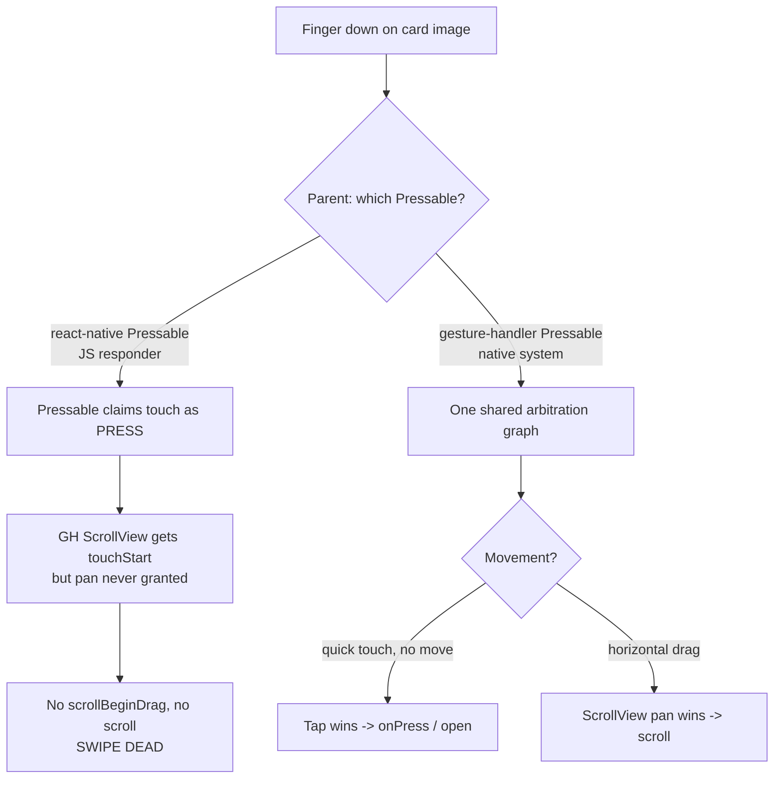

**Topic:** React Native: JS Responder vs gesture-handler systems
**Tags:** react-native, gestures, react-native-gesture-handler, scrollview, touch-handling
**Summary:** React Native has two mutually-blind gesture systems; nesting a gesture-handler ScrollView under an RN Pressable kills swipe.

## Mental model

React Native ships with **two separate gesture systems that do not talk to each other**. The classic **JS Responder System** (used by `react-native`'s `Pressable`/`Touchable*`) negotiates a single "responder" per touch on the JS thread. The modern **gesture-handler system** (`react-native-gesture-handler`'s `ScrollView`/`Pressable`/`GestureDetector`) recognizes gestures natively, off the JS thread, with an explicit arbitration graph (wait-for, simultaneous, require-failure). When a component from one system is nested inside a component from the other and both want the same touch, there is **no shared referee** — and in practice the JS responder grabs the initial claim, starving the native handler. The fix is never "tweak the ScrollView"; it's "put the whole touch hierarchy on one system."

## Diagram



## Prerequisites

- Touch events bubble (touchStart fires on the target and up the tree), but the **responder** (who gets the *move/scroll* stream) is decided separately.
- Knowledge that RN runs JS on one thread; gesture-handler recognizes gestures on the native/UI side.
- What `Pressable` and a horizontal `ScrollView` are, and that a carousel is a horizontally-scrolling list nested inside a vertically-scrolling one (e.g. cards in a FlashList).

## How it actually works

1. **JS Responder System** — On touch-down, components negotiate via `onStartShouldSetResponder` / `onMoveShouldSetResponder`. Exactly one component becomes the responder and **captures** the gesture; the rest are locked out for that touch. This is what `react-native`'s `Pressable`/`Touchable*` and raw touch events use. It is JS-thread-bound.
2. **gesture-handler system** — Handlers (`Pan`, `Tap`, the GH `ScrollView`'s internal pan, etc.) are declared and arbitrated **natively**. They can be told to wait for one another, run simultaneously, or require another's failure. This is what allows a tap and a pan to coexist cleanly.
3. **The blindness** — These two systems do not share the negotiation. A GH handler and a JS-responder component have no common arbiter. So when an RN `Pressable` wraps a GH `ScrollView`, the press claims the touch first (JS responder), and the GH pan never gets permission to activate.
4. **Diagnosis method (top-down logging)** — Render logs first: confirm the carousel mounts with a sane `viewportWidth` and content wider than the viewport (rules out width/mount bugs). Then touch logs at each layer: if `onTouchStart` fires on the ScrollView but `onScrollBeginDrag`/`onScroll` never fire, the finger is reaching the scroller but the **pan is being absorbed** — a gesture-arbitration problem, not layout.
5. **The fix** — Put both the card tap and the carousel scroll on the **same** system: import `Pressable` from `react-native-gesture-handler` for the parent card. Now one arbitration graph resolves tap-vs-pan: quick touch = tap (open), horizontal drag = scroll.

## Two examples

**Example 1 — canonical (works):** parent tap and child scroll on the same (gesture-handler) system.
```tsx
import { Pressable } from 'react-native-gesture-handler'   // NOT 'react-native'
import { ScrollView } from 'react-native-gesture-handler'

function Card({ onOpen, images }) {
  return (
    <Pressable onPress={onOpen}>
      <ScrollView horizontal snapToInterval={W}>
        {images.map(uri => <Tile key={uri} uri={uri} />)}
      </ScrollView>
    </Pressable>
  )
}
// Tap -> onOpen. Horizontal drag -> ScrollView scrolls. GH arbitrates both.
```

**Example 2 — wrong but tempting (swipe dead):** the same tree with RN's `Pressable`.
```tsx
import { Pressable } from 'react-native'                    // JS responder
import { ScrollView } from 'react-native-gesture-handler'   // native system

<Pressable onPress={onOpen}>
  <ScrollView horizontal>{/* receives touchStart, never pans */}</ScrollView>
</Pressable>
// Tap works; swipe does nothing. The Pressable captured the touch first and
// the two systems don't negotiate, so the pan is never granted.
```

## Why it's written this way

- **Swapping the ScrollView's props doesn't help** — `scrollEnabled`, `scrollEventThrottle`, etc. are irrelevant when the pan never gets to activate. The blocker is one level up (the parent's gesture system), so that's where the fix must be.
- **Why not just use RN's ScrollView for the carousel too?** Then both are JS-responder, but a horizontal ScrollView nested in a vertical list + a press target still arbitrates poorly (especially on Android) — gesture-handler exists precisely to make these coexist.
- **Alternative: `react-native-reanimated-carousel`** — works out of the box because it's gesture-handler all the way down (its `Gesture.Pan()` composes with parents). Good when you don't control the parent, or want richer paging; heavier than a plain ScrollView for a simple peek strip.

## Failure modes

- **Tap eats swipe:** RN `Pressable`/`TouchableOpacity` wrapping any gesture-handler scrollable/pannable → horizontal swipe silently dies.
- **Misreading it as a layout bug:** chasing `width`/`overflow` when render logs already prove the content overflows — the symptom is identical, so always check `scrollBeginDrag` fires before touching widths.
- **Nested scrollables across systems:** a GH horizontal list inside an RN vertical scroll (or vice-versa) — orthogonal directions still fight without a shared arbiter.
- **Partial migration:** converting the child to gesture-handler but leaving the ancestor on RN touchables — the bug persists until the ancestor is migrated too.

## Quiz

### Q1

A horizontal gesture-handler `ScrollView` nested inside a `react-native` `Pressable` receives `onTouchStart` but never fires `onScrollBeginDrag`. Tap still works. What is happening and why?

**Answer:** The RN `Pressable` (JS responder system) claims the touch as a press on touch-down. The GH `ScrollView` lives in gesture-handler's separate native gesture system, which doesn't negotiate with the JS responder, so its pan is never granted activation. The touch reaches the ScrollView (touchStart bubbles) but the pan can't win, so no scroll begins.

### Q2

You can reproduce a "swipe does nothing" carousel bug two ways: bad width (content not wider than viewport) or gesture absorption. How do logs distinguish them?

**Answer:** Render logs: if the carousel mounts with `viewportWidth > 0` and content wider than the viewport, it's NOT a width/mount bug. Touch logs: if `onTouchStart` fires on the scroller but `onScrollBeginDrag`/`onScroll` never do, the gesture is being absorbed (arbitration), not a layout problem.

### Q3

What is the general rule for mixing `react-native` touchables with `react-native-gesture-handler` components in a parent/child hierarchy?

**Answer:** Don't mix them — keep a touch hierarchy on one system. If a child needs gesture-handler (swipe/pan/scroll that must coexist with a tap or another scroll), its touch-handling ancestors must also be gesture-handler (e.g. use gesture-handler's `Pressable` for the parent card). `react-native-reanimated-carousel` works precisely because it's gesture-handler all the way down.
