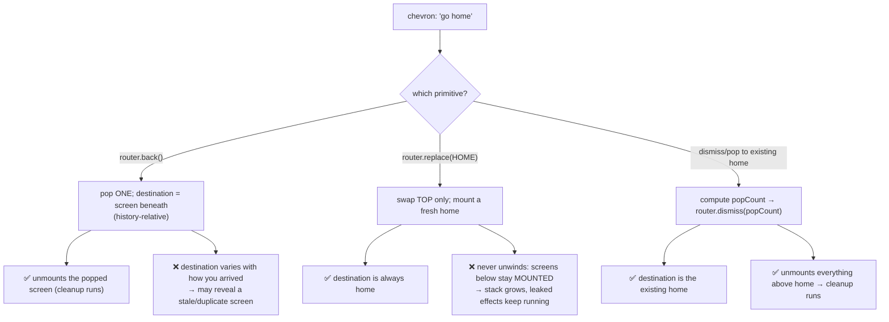

**Topic:** React Navigation stack: back vs replace vs dismiss
**Tags:** react-navigation, expo-router, navigation-stack, memory-leaks, react-native
**Summary:** Native stack screens stay mounted when defocused; back/replace/dismiss differ in both destination and teardown, which decides correctness and leaks.

## Mental model

A native stack navigator is a **stack of mounted screens**. Only the top one is focused and visible, but the screens beneath it are **not unmounted** — their components, `useEffect`s, timers, and store subscriptions all stay alive, just hidden. Navigation verbs differ along **two independent axes**: (1) *what they do to the stack* — `push` adds on top, `replace` swaps only the top, `pop`/`dismiss` removes from the top; and (2) *how they pick the destination* — `back()` is **history-relative** ("undo my last navigation," whatever is beneath), while `replace`/`navigate`/dismiss-to-target are **declarative** ("go to this route"). A button whose contract is "always go to X" must be declarative *and* must unwind the stack — otherwise it either lands on the wrong screen (history-relative) or leaks mounted screens (swap-only).

## Diagram



## Prerequisites

- React component lifecycle: mount/unmount, and `useEffect` cleanup runs **on unmount**, not on blur/defocus.
- What a stack navigator is (push/pop, focused vs background screens).
- Single-JS-thread model: every mounted component's selectors/subscriptions/timers compete for one thread.

## How it actually works

1. **Screens beneath the top stay mounted.** React Navigation keeps background stack entries alive so a back gesture is instant. Consequence: their effects keep firing. An interval/poll started in `useEffect` keeps ticking; an `AppState` listener stays subscribed; a store selector re-runs on every dispatch — all while the screen is invisible.

2. **`router.back()` is history-relative.** It pops one entry and shows whatever is underneath. The *handler* is fixed, but the *destination* is a function of the stack, which is a function of how the user navigated in. If some flow left a duplicate or intermediate screen beneath the current one, `back()` reveals that — not the screen you assumed.

3. **`router.replace(X)` swaps only the top.** It unmounts the current top and mounts `X`, but **does nothing to the entries below**. So a loop of `navigate → replace(HOME)` produces `[home, home]`, then `[home, home, listing]`, then `[home, home, home]`… The stack grows without bound, each retained screen still mounted and still working. The "new" home you land on is slow because it shares the thread and memory with all the leaked ones.

4. **Dismiss/pop-to-target gives both properties.** Find the target route in the stack and pop down to it:
   ```ts
   const state = navigation.getState()
   const homeIndex = state?.routes.findIndex(r => r.name === homeName) ?? -1
   const popCount = state.routes.length - 1 - homeIndex
   if (popCount > 0) router.dismiss(popCount)
   ```
   Popping removes the intermediate screens → they **unmount** → their cleanup runs (clear timers, remove listeners, drop subscriptions) → and you land on the **existing** target instance, not a freshly mounted duplicate.

5. **The one-line model.** `back()` answers *"what did I come from?"*. `replace(X)` answers *"put X on top (and forget the rest is still running)"*. **Dismiss-to-target answers *"rewind to the X that's already there, cleaning up everything in between."*** Only the last is correct for a button whose contract is "always go to X."

## Two examples

**Example 1 — canonical (deterministic destination + clean teardown):**
```ts
const goHome = useCallback(() => {
  const homeRoute = RouteService.getRoute(RouteType.HOME)        // '/home'
  const homeName = typeof homeRoute === 'string'
    ? homeRoute.replace(/^\//, '')                                // 'home'
    : ''
  const state = navigation.getState()
  const homeIndex = state?.routes.findIndex(r => r.name === homeName) ?? -1

  if (homeIndex >= 0 && state) {
    const popCount = state.routes.length - 1 - homeIndex
    if (popCount > 0) router.dismiss(popCount)                    // pop to EXISTING home
    return
  }
  router.replace(homeRoute)                                       // fallback: home not in stack
}, [router, navigation])
```

**Example 2 — wrong-but-tempting (the two half-right traps):**
```ts
// Trap A — history-relative: destination depends on the stack, not the intent.
if (router.canGoBack()) {
  router.back()                 // may reveal a stale/duplicate screen instead of home
} else {
  router.replace(HOME)
}

// Trap B — declarative destination, but never unwinds → leak.
router.replace(HOME)            // [home, X] -> [home, home] -> grows; X (and its timers) stays mounted
```

## Why it's written this way

- **Declarative beats imperative for fixed-destination buttons.** A "home"/"close"/"done" button has a single correct target; encoding it as "undo history" couples a UI guarantee to navigation history you don't control.
- **Unwinding is what frees resources.** Cleanup is tied to *unmount*, and only popping unmounts. `replace` feels like "going somewhere fresh" but silently retains everything below — the classic source of "the app gets slower the more I navigate."
- **Pop-to-existing avoids duplicate heavy screens.** Re-mounting a fresh home (via `replace`) on top of an old home means two heavy screens doing data fetches/subscriptions. Popping reuses the one that's already warm.

## Failure modes

- **Stale/wrong landing:** `back()` surfaces an unexpected screen because some flow (e.g., edit-then-replace) left a duplicate or intermediate entry beneath the current one.
- **Unbounded stack growth:** repeated `replace`-to-a-fixed-route piles up mounted screens; memory climbs and the JS thread thrashes.
- **Zombie background work:** a defocused-but-mounted screen keeps its polling interval / `AppState` listener / WebSocket alive → wasted network, battery, and CPU that slows the *visible* screen.
- **Duplicate expensive mounts:** two instances of a heavy screen (each with its own queries/selectors) running simultaneously.
- **False assumption that blur == teardown:** developers expect cleanup when a screen is no longer visible; it only happens on unmount (pop), not on losing focus.

## Quiz

### Q1

A 'go home' button uses `canGoBack() ? router.back() : router.replace(HOME)`. Sometimes it lands on home, sometimes on an unrelated screen. Why is the outcome inconsistent even though the handler never changes?

**Answer:** Because `router.back()` is history-relative: it pops one entry and reveals whatever happens to sit beneath the current screen. The destination is decided by how the user arrived (push from home → home below; an edit flow → a duplicate screen below), not by the handler. A "go home" contract must be declarative (pop/navigate to the home route), never history-relative.

### Q2

Why can repeatedly leaving a screen with `router.replace(HOME)` make the home screen progressively slower, even though replace 'removes' the current screen?

**Answer:** `replace()` only swaps the top route; it never unwinds the stack. In a native stack, defocused screens stay **mounted**. So navigate→replace→navigate→replace accumulates mounted screens (including duplicate homes) whose effects — polling loops, `AppState` listeners, store subscriptions — keep running on the single JS thread. The newly shown home is starved by all the still-working leaked screens.

### Q3

You want a button that always lands on the existing home AND tears down everything opened on top of it. Which navigation primitive and why — `back()`, `replace()`, or dismiss-to-target?

**Answer:** Dismiss/pop to the target: compute `popCount` down to the existing home route and `router.dismiss(popCount)`. Popping removes the intermediate screens, which unmounts them and runs their `useEffect` cleanup (clearing timers, removing listeners, dropping subscriptions), and it lands on the home instance already in the stack rather than mounting a new one. `back()` has the wrong/variable destination; `replace()` leaks because it never unwinds.
