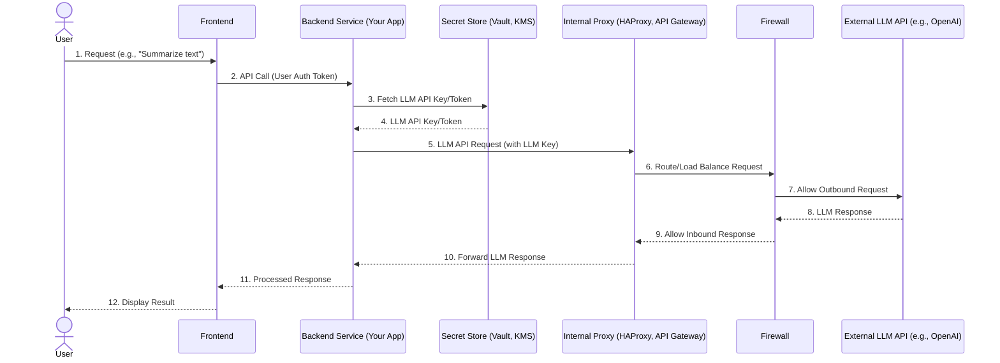

## Mental model
Imagine your backend service as a highly secure, specialized agent within a fortress (your company's network). This agent is tasked with talking to external, powerful entities (LLMs) on behalf of internal users. To do this, it doesn't just call them directly; it follows strict protocols. It retrieves its credentials from a hidden vault, routes its messages through a heavily guarded gate that inspects and optimizes traffic (like an HA proxy), and constantly reports its activities to security personnel (SecOps). This layered approach ensures that sensitive credentials never leave the fortress, all communications are monitored, and the system remains robust and compliant.

## Diagram


## Prerequisites
*   **Client-Server Architecture:** Understanding how a frontend application communicates with a backend server.
*   **HTTP Requests:** Familiarity with how data is sent and received over the web.
*   **Authentication & Authorization:** Basic knowledge of how users and systems prove their identity and what they're allowed to do, including [[authentication-tokens-bearer-tokens-and-sso]].
*   **Networking Basics:** Concepts like IP addresses, ports, and the idea of a proxy server.

## How it actually works

When your backend service needs to interact with an LLM API, especially in a large organization, it involves several layers of security, routing, and management:

1.  **User Request (User -> Frontend -> Backend):**
    *   `User` sends a request to the `Frontend` (e.g., a web app).
    *   `Frontend` makes an API call to your `BackendService`, including the user's authentication token (e.g., a JWT).
    *   `BackendService` validates the user's token and authorizes the request. This ensures only legitimate users can trigger LLM calls.

2.  **Secret Retrieval (Backend -> Secret Store):**
    *   The `BackendService` needs to authenticate itself to the `ExternalLLM` API. This is typically done using an API key or an OAuth token provided by the LLM provider.
    *   **Crucially, this LLM API key/token is *never* hardcoded in the application or stored directly in environment variables in production.** Instead, the `BackendService` makes a secure call to a dedicated `SecretStore` (e.g., HashiCorp Vault, AWS Secrets Manager, Azure Key Vault, Google Secret Manager).
    *   The `SecretStore` securely provides the `BackendService` with the necessary LLM API key/token. Access to the `SecretStore` is tightly controlled, often using [[authentication-tokens-bearer-tokens-and-sso]] or IAM roles specific to the backend service.

3.  **LLM API Request via Internal Infrastructure (Backend -> Internal Proxy -> Firewall -> External LLM):**
    *   With the LLM API key, the `BackendService` constructs the request to the `ExternalLLM` (e.g., `POST https://api.openai.com/v1/chat/completions`).
    *   Instead of directly connecting to the internet, this request is routed through internal enterprise infrastructure:
        *   **Internal Proxy (e.g., HAProxy, Nginx, API Gateway):** The request first hits an `InternalProxy`. This proxy serves multiple purposes:
            *   **Load Balancing:** Distributes requests across multiple instances of the LLM API if there are internal proxies to a cached LLM or if the LLM provider uses multiple endpoints. More commonly, it balances traffic for *your* backend services, and acts as a single egress point for external calls.
            *   **Traffic Routing:** Directs requests to the correct external endpoint.
            *   **Security & Policy Enforcement:** Can inspect requests, enforce rate limits, block malicious traffic, and add/remove headers. In an MNC, this is a critical control point.
            *   **Observability:** Logs all outgoing traffic, which is vital for monitoring and auditing (as discussed in [[mixpanel-sentry-datadog-explained]]).
        *   **Firewall:** After the proxy, the request passes through the corporate `Firewall`. The firewall's role is to explicitly permit or deny network traffic based on predefined rules. For LLM calls, it ensures that your `BackendService` can *only* connect to approved LLM endpoints and no other arbitrary external IPs. This prevents data exfiltration or unauthorized access.
        *   **SecOps Involvement:** Security Operations (SecOps) teams are responsible for defining and auditing these firewall rules, proxy configurations, and secret management policies. They ensure that all external communication adheres to the company's security posture, regulatory compliance (e.g., GDPR, HIPAA), and internal standards.

4.  **LLM Response (External LLM -> Firewall -> Internal Proxy -> Backend):**
    *   The `ExternalLLM` processes the request and sends back a response.
    *   This response travels back through the `Firewall` (which must be configured to allow the return traffic) and then through the `InternalProxy`.
    *   The `InternalProxy` forwards the response to your `BackendService`.

5.  **Final Processing (Backend -> Frontend -> User):**
    *   The `BackendService` receives and processes the LLM's response (e.g., extracts the generated text, handles errors).
    *   It then sends the processed response back to the `Frontend`.
    *   The `Frontend` displays the result to the `User`.

## Two examples
### Example 1 — canonical: Secure LLM call from a Node.js backend
```javascript
// backend/src/llmService.js
const { OpenAI } = require('openai');
const { getSecret } = require('./secretManager'); // Simulated secret manager

async function callOpenAI(prompt) {
    try {
        // 1. Fetch API key securely from a secret store
        const openaiApiKey = await getSecret('OPENAI_API_KEY');
        if (!openaiApiKey) {
            throw new Error('OpenAI API key not found.');
        }

        // Initialize OpenAI client with the retrieved key
        const openai = new OpenAI({ apiKey: openaiApiKey });

        // 2. Make the LLM API call
        const completion = await openai.chat.completions.create({
            model: "gpt-3.5-turbo",
            messages: [{ role: "user", content: prompt }],
        });

        return completion.choices[0].message.content;
    } catch (error) {
        console.error("Error calling OpenAI:", error);
        throw new Error("Failed to get response from LLM.");
    }
}

// Simulated secret manager (in a real app, this would integrate with Vault/KMS)
async function getSecret(keyName) {
    // In a real application, this would call a Secret Store service
    // e.g., AWS Secrets Manager, HashiCorp Vault.
    // For this example, we'll use a process environment variable,
    // but emphasize that this is generally NOT for production LLM keys.
    return process.env[keyName];
}

// Example usage in an Express route
// app.js
// const express = require('express');
// const app = express();
// app.use(express.json());
//
// app.post('/summarize', async (req, res) => {
//     const { text } = req.body;
//     if (!text) {
//         return res.status(400).send('Text is required.');
//     }
//     try {
//         const summary = await callOpenAI(`Summarize the following text: ${text}`);
//         res.json({ summary });
//     } catch (error) {
//         res.status(500).send(error.message);
//     }
// });
//
// app.listen(3000, () => console.log('Server running on port 3000'));
```
**Explanation:**
*   `getSecret('OPENAI_API_KEY')`: This line simulates fetching the API key from a secure `SecretStore`. In a real MNC setup, this `getSecret` function would make a network call to a dedicated secret management service.
*   `new OpenAI({ apiKey: openaiApiKey })`: The LLM client is initialized with the securely retrieved key.
*   `openai.chat.completions.create(...)`: The actual API call is made. This call would implicitly go through the `InternalProxy` and `Firewall` configured at the network level for the `BackendService`.

### Example 2 — wrong-but-tempting / edge case: Hardcoding LLM API keys
```javascript
// backend/src/llmService_BAD.js
const { OpenAI } = require('openai');

// WARNING: DO NOT DO THIS IN PRODUCTION!
// Hardcoding API keys or storing them directly in .env files without
// robust secret management is a major security risk.
const OPENAI_API_KEY = "sk-YOUR_HARDCODED_SECRET_KEY_HERE"; // This is BAD

async function callOpenAI_BAD(prompt) {
    try {
        const openai = new OpenAI({ apiKey: OPENAI_API_KEY }); // Key directly used

        const completion = await openai.chat.completions.create({
            model: "gpt-3.5-turbo",
            messages: [{ role: "user", content: prompt }],
        });

        return completion.choices[0].message.content;
    } catch (error) {
        console.error("Error calling OpenAI:", error);
        throw new Error("Failed to get response from LLM.");
    }
}
```
**Why it's wrong:**
*   **Security Vulnerability:** If this code repository (or a build artifact) is ever exposed, the LLM API key is immediately compromised. An attacker could use it to incur huge costs, access sensitive data, or impersonate your service.
*   **Lack of Rotation:** Hardcoded keys are difficult to rotate periodically, which is a standard security practice.
*   **Auditability:** It's harder to track who accessed or used the key.
*   **Environment Specificity:** You can't easily use different keys for different environments (dev, staging, prod).

## Why it's written this way
This layered approach, common in MNCs, is designed to address critical concerns:

1.  **Security:**
    *   **Secrets Management:** Prevents [[memory-leaks-in-react-redux-and-zustand-summary]] of sensitive API keys by centralizing their storage and access control. Only authorized backend services can retrieve them, and they are never exposed to the frontend or directly committed to code. This mitigates the risks of unauthorized access and financial abuse of LLM APIs.
    *   **Perimeter Defense:** `Firewalls` and `Internal Proxies` act as gatekeepers, controlling what traffic can enter and leave the corporate network. This prevents unauthorized outbound connections and protects against various network attacks.
    *   **Compliance:** Many regulations (e.g., GDPR, HIPAA) mandate strict control over data access and network security. This architecture provides the necessary controls and audit trails.

2.  **Reliability & Performance:**
    *   **HA Proxy (High Availability Proxy):** Ensures that if one path to an external service fails, another can be used. It can also load balance requests if there are multiple LLM endpoints or internal caches, improving throughput and reducing latency.
    *   **Rate Limiting:** Proxies can enforce rate limits on outgoing LLM requests, preventing your backend from accidentally (or intentionally) overwhelming the LLM provider and incurring excessive costs or getting temporarily blocked.

3.  **Observability & Governance:**
    *   **Centralized Logging:** Proxies and firewalls can log all traffic, providing a comprehensive audit trail of who called which LLM, when, and with what parameters. This is crucial for debugging, security audits, and cost analysis. Tools like Datadog or Sentry (as discussed in [[mixpanel-sentry-datadog-explained]]) can ingest these logs.
    *   **SecOps Control:** It gives `SecOps` teams a centralized point to review, approve, and enforce security policies for all external API integrations, ensuring consistency and adherence to corporate standards.

4.  **Scalability:**
    *   The `Internal Proxy` can help manage traffic as your application scales, ensuring that outgoing requests are handled efficiently without overwhelming individual backend instances.

## Failure modes
1.  **API Key Leakage:** If the `SecretStore` is misconfigured or the `BackendService`'s access credentials to the `SecretStore` are compromised, LLM API keys could be stolen. This could lead to unauthorized usage, high costs, or data breaches.
2.  **Misconfigured Firewall Rules:** Incorrectly configured `Firewall` rules could inadvertently block legitimate LLM API calls (leading to service outages) or, worse, allow unauthorized outbound connections, creating a security hole.
3.  **Proxy Bottlenecks/Single Point of Failure:** A poorly configured or under-provisioned `HA Proxy` could become a bottleneck, slowing down all LLM interactions. If not set up for high availability, the proxy itself could become a single point of failure, bringing down LLM functionality.
4.  **Lack of Rate Limiting:** Without proper rate limiting at the `Internal Proxy` or within the `BackendService`, a bug or malicious actor could trigger an excessive number of LLM calls, leading to massive bills or temporary service bans from the LLM provider.
5.  **Data Exfiltration through LLM Prompts:** If user input is directly passed to the LLM without sanitization or validation, sensitive internal data could accidentally be included in prompts, potentially exposing it to the LLM provider or, if the LLM is compromised, to third parties.

## Quiz
### Q1
Consider a scenario where a React Native frontend application directly calls an `ExternalLLM` API using an API key embedded in the client-side code. What are the primary security risks of this approach, especially in an enterprise setting?
**Answer:** The main risk is API key exposure. Any user or attacker can inspect the client-side code (e.g., via browser developer tools or by decompiling the mobile app) and extract the API key. Once compromised, this key can be used by the attacker to make unauthorized calls to the LLM API, leading to excessive costs, potential data exfiltration, or service abuse, bypassing all enterprise network controls.

### Q2
In the diagram, why is the `InternalProxy` (like `HAProxy`) placed between the `BackendService` and the `Firewall` for outgoing LLM API calls, rather than the `BackendService` calling the `Firewall` directly?
**Answer:** The `InternalProxy` serves as a crucial intermediary for several reasons beyond just routing. It can provide centralized **load balancing** for outbound traffic, enforce **rate limits** to prevent abuse of external APIs, perform **request inspection** and modification for security or compliance, and offer a single point for **logging and monitoring** all external communications. While the `Firewall` provides network-level access control, the `InternalProxy` adds application-aware traffic management and policy enforcement, which is vital for enterprise-grade security and operational control.

### Q3
If the `SecretStore` were to experience an outage or become inaccessible to the `BackendService`, what immediate impact would that have on the application's functionality related to LLMs, and what broader implications might arise?
**Answer:** The immediate impact would be that the `BackendService` would be unable to retrieve the necessary LLM API keys/tokens. Consequently, all subsequent attempts to call the `ExternalLLM` API would fail due to lack of authentication. This would render any features relying on LLM interactions unusable, leading to a significant service outage for those specific functionalities. Broader implications could include user dissatisfaction, potential loss of revenue, and a critical security incident if the outage was due to a breach rather than a technical failure.

## Links
- **Background:** [[authentication-tokens-bearer-tokens-and-sso]] — Explains how tokens are used for authentication and authorization, which is fundamental to securing API calls.
- **Related:** [[frontend-architecture-patterns-tradeoffs]] — Discusses patterns where a backend acts as a gateway or BFF, which is precisely the role it plays here for LLM interaction.
- **Related:** [[mixpanel-sentry-datadog-explained]] — Observability tools mentioned are crucial for monitoring the health and security of these LLM API interactions and infrastructure components.
- **Background:** [[large-language-models-llms-explained]] — Provides foundational knowledge about LLMs, which are the external services being integrated.
