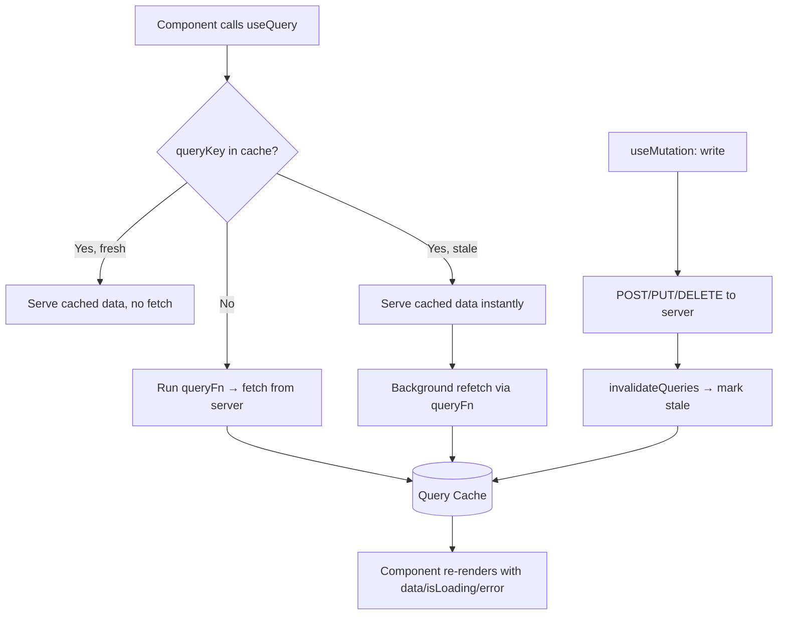

**Topic:** TanStack Query: server-state management
**Tags:** tanstack-query, react-query, server-state, data-fetching, caching, react
**Summary:** TanStack Query manages remote server state — caching, deduping, background refetch and mutations — so you stop hand-rolling loading/error/cache boilerplate.

## Mental model

TanStack Query (formerly React Query) is a **server-state** library, not a general state container. The key insight is that data fetched from a remote server is a fundamentally different beast from local UI state: you don't *own* it, your copy is just a cached snapshot that can go stale the moment after you fetch it, it's shared across many components, and keeping it usefully fresh requires caching, deduplication, and background refreshing. Redux/Zustand/Context model **client state** (a modal's open/closed flag, a form's current input) — state you own and that is always correct by definition. TanStack Query models the *other half* — the snapshot-of-something-remote — and gives you the cache, the freshness policy, and the refetch machinery for free, keyed by a `queryKey`. It's framework-agnostic (React, Vue, Svelte, Solid, Angular adapters), but the React adapter is the canonical one.

## Diagram



## Prerequisites

- React hooks (`useState`, `useEffect`) and why `useEffect`-based fetching gets repetitive
- The difference between **client state** (UI you own) and **server state** (a remote snapshot)
- Promises / async functions — `queryFn` returns a promise
- (For the comparison section) a passing idea of Redux + redux-saga side-effect orchestration

## How it actually works

**1. You wrap your app in a `QueryClientProvider`.** A single `QueryClient` holds the in-memory query cache.

```tsx
const queryClient = new QueryClient()
<QueryClientProvider client={queryClient}>
  <App />
</QueryClientProvider>
```

**2. `useQuery` for reads.** You give it a `queryKey` (the cache identity) and a `queryFn` (how to fetch). Everything else — loading, error, caching, refetch — is derived.

```tsx
const { data, isLoading, error, isFetching } = useQuery({
  queryKey: ['hotels', { city, checkIn }],   // identity — changes here = new cache entry
  queryFn: () => fetchHotels({ city, checkIn }),
})
```

The `queryKey` is the heart of it. Two components calling `useQuery(['hotels', params])` with the *same* key share one cache entry and **one network request** — automatic deduplication. Change a value inside the key and it's a different query that fetches fresh.

**3. Freshness is two timers, not one.** This trips everyone up:
- `staleTime` (default `0`) — how long fetched data is considered **fresh**. While fresh, mounting the component or refocusing the window does *not* trigger a refetch.
- `gcTime` (default 5 min) — how long an **unused** query's data lingers in cache after the last component using it unmounts, before it's garbage-collected.

So a query can be *stale but cached*: TanStack serves the stale snapshot instantly (no spinner), then silently refetches in the background and re-renders when fresh data arrives. That's the **stale-while-revalidate** behavior.

**4. `useMutation` for writes.** Reads are cached; writes are explicit. After a write succeeds you typically *invalidate* related queries so they refetch the server's authoritative result.

```tsx
const { mutate, isPending } = useMutation({
  mutationFn: (body) => bookHotel(body),
  onSuccess: () => queryClient.invalidateQueries({ queryKey: ['bookings'] }),
})
```

**5. Background triggers.** Out of the box it refetches on window focus, on network reconnect, and on `refetchInterval` if you set one — keeping data live without you wiring listeners.

## Two examples

**Example 1 — canonical: replacing hand-rolled `useEffect` fetching.**

```tsx
// BEFORE — the boilerplate you write per endpoint
function HotelList({ params }) {
  const [data, setData] = useState(null)
  const [loading, setLoading] = useState(true)
  const [error, setError] = useState(null)

  useEffect(() => {
    let cancelled = false
    setLoading(true)
    fetchHotels(params)
      .then((d) => !cancelled && setData(d))
      .catch((e) => !cancelled && setError(e))
      .finally(() => !cancelled && setLoading(false))
    return () => { cancelled = true }   // manual race-condition guard
  }, [params])
  // no caching, no dedupe, no background refresh, refetches every mount
}

// AFTER — same behavior plus cache, dedupe, refetch-on-focus, for free
function HotelList({ params }) {
  const { data, isLoading, error } = useQuery({
    queryKey: ['hotels', params],
    queryFn: () => fetchHotels(params),
    staleTime: 60_000,   // results good for 1 min — don't refetch on every remount
  })
}
```

**Example 2 — wrong-but-tempting: putting non-identifying data in the queryKey (or leaving it out).**

```tsx
// WRONG — token in the key. Token rotates → key changes → cache busts on every refresh,
// and the same logical data is cached under N different keys (memory bloat + redundant fetches).
useQuery({ queryKey: ['profile', authToken], queryFn: () => fetchProfile(authToken) })

// WRONG (other direction) — params that DO change the result are omitted from the key.
// Switch city, key stays ['hotels'], you get the previous city's cached results.
useQuery({ queryKey: ['hotels'], queryFn: () => fetchHotels(city) })

// RIGHT — the key contains exactly what identifies the result, nothing that's just "how to fetch".
useQuery({ queryKey: ['hotels', city, checkIn], queryFn: () => fetchHotels(city, checkIn) })
```

The rule: the `queryKey` is the data's **identity**, not its **credentials**. Anything that changes *what data you get back* belongs in the key; anything that's just *how to authenticate the fetch* does not.

## Why it's written this way

The library's whole design follows from one decision: **cache by key, with a freshness policy, separate from your component state.** Because the cache lives in the `QueryClient` (not in component `useState`), two distant components asking for the same data share it and dedupe the request — impossible with per-component `useEffect`. Because freshness is a declarative `staleTime` rather than imperative refetch calls, the stale-while-revalidate UX (instant paint, silent refresh) is the default rather than something you choreograph.

**Named alternative — Redux + redux-saga (your crew-frontend-monorepo today):** sagas can absolutely fetch, cache in the store, and orchestrate. But you write the loading/error/cache/dedup/invalidation logic *by hand* for each resource — exactly the boilerplate TanStack collapses. The flip side: TanStack is *only* server state. It is **not** a replacement for sagas when you need complex side-effect choreography (debounced search → cancel previous → chain dependent calls → coordinate with WebSocket events). The mature pattern is **both**: TanStack Query for "GET-then-display" data, and Redux/Zustand for pure UI state and saga for genuinely complex orchestration. Reaching for Redux to cache a list of hotels is over-engineering; reaching for TanStack to manage a multi-step booking saga with socket events is under-powered.

## Failure modes

- **`staleTime: 0` (default) feels like "it refetches constantly."** Every remount and window-focus triggers a background fetch. Looks like a bug, is actually the default. Set a sensible `staleTime` for data that doesn't change second-to-second.
- **Unstable `queryKey`.** Passing a freshly-constructed object/array literal that's value-equal but reference-new is fine (TanStack hashes keys structurally) — but putting a rotating token or a `Date.now()` in the key silently fragments the cache and busts dedup.
- **Mutating then reading without invalidating.** You POST a new booking, the bookings list still shows the old data because nothing told that query to refetch. Forgetting `invalidateQueries` (or a manual `setQueryData`) is the #1 "why is my UI stale" bug.
- **Treating it as a client-state store.** Stuffing UI flags ("is this drawer open") into the query cache. It has no native concept of that; you lose the ergonomics of `useState` and gain nothing.
- **Optimistic update without rollback.** If you `setQueryData` optimistically but don't roll back in `onError`, a failed mutation leaves the UI showing a change the server rejected.

## Quiz

### Q1

Why is server state fundamentally different from client state, and why does that distinction justify a dedicated library?

**Answer:** Server state is owned remotely — your copy is a snapshot that can go stale, is shared across components, and needs caching/refetch/dedupe. Client state (toggles, form inputs) is owned locally and is always authoritative. Redux/Zustand model the second well but give you nothing for staleness, background refresh, or request dedup, so you end up rebuilding those by hand per endpoint. TanStack Query encodes them once, keyed by `queryKey`.

### Q2

What does `staleTime` control, and how is it different from `gcTime`?

**Answer:** `staleTime` is how long after a successful fetch the data is considered fresh — while fresh, no background refetch fires on mount/focus. `gcTime` (garbage-collection time) is how long an *unused* query's cached data is kept in memory after the last observer unmounts. `staleTime` governs refetching of mounted queries; `gcTime` governs eviction of unmounted ones. A query can be stale but still cached (so it shows instantly, then refetches).

### Q3

After a `useMutation` succeeds, why call `queryClient.invalidateQueries` instead of manually setting the new data into state?

**Answer:** `invalidateQueries` marks the affected queries stale and refetches them, so the cache re-syncs with the server's authoritative version — capturing any server-side side effects (computed fields, timestamps, triggers) you couldn't predict locally. Manually setting state assumes your optimistic value equals the server's, which drifts. Optimistic updates are fine for instant UI, but invalidation on settle is what keeps the snapshot honest.
