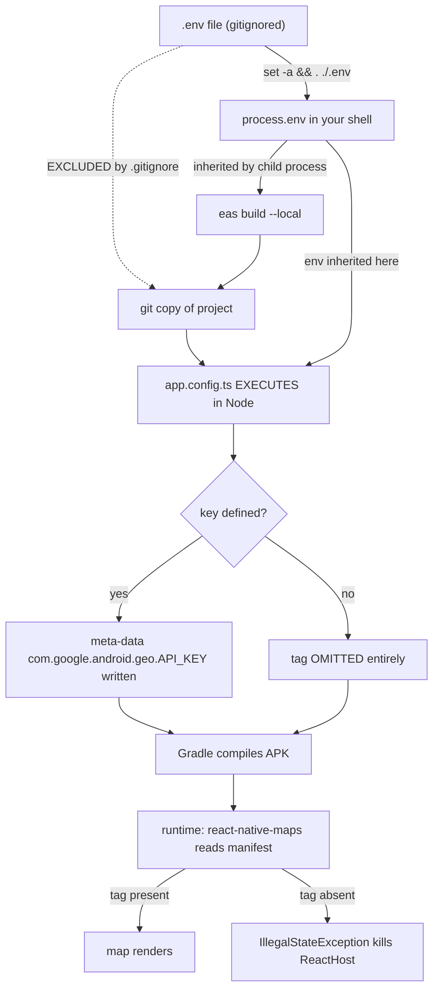

**Topic:** Expo local vs cloud builds and the env-var gap
**Tags:** expo, eas-build, android, environment-variables, react-native
**Summary:** Why EAS builds cannot see gitignored .env files, how APKs are assembled, and how to pass secrets without committing them.

## Mental model

An Expo app has two halves that are built by completely different machinery: the JavaScript half, which Metro concatenates into a single text file, and the native half, which Gradle compiles into an APK. The native half is not source you write — Expo *generates* `android/` from `app.config.ts`, and `app.config.ts` is a JavaScript **program that executes in Node** and reads `process.env` while it runs. So an environment variable is not a runtime setting; it is a **build-time input** whose value gets frozen into `AndroidManifest.xml` and can never be recovered afterwards. The trap is that EAS never builds your working directory — it builds a **git copy** that honours `.gitignore`. Since `.env` is gitignored, it simply does not exist in the directory where `prebuild` runs, and every `process.env` read there returns `undefined`. The fix is to stop thinking of `.env` as a file the build reads, and instead hand the value over as a **process environment variable**, which child processes inherit through memory rather than through git.

## Diagram



## Prerequisites

- What an environment variable is, and that child processes inherit the parent's environment
- Basic git ignore semantics
- That React Native apps ship JS as an asset inside a native binary
- Roughly what a shell `&&` chain does

## How it actually works

### 1. What an APK contains

An APK is a ZIP with a fixed layout: `AndroidManifest.xml` (permissions, components, `<meta-data>`), `classes.dex` (Java/Kotlin compiled to DEX bytecode for the ART runtime), `lib/<abi>/*.so` (native machine code per CPU architecture), `res/` + `resources.arsc`, `META-INF/` (signature), and `assets/index.android.bundle` — **your entire JavaScript app as one text file**. Your TypeScript is never compiled to machine code; it ships as a data asset.

An **AAB** is different: not installable, it is the Play Store *upload* format. Google generates a minimal per-device APK from it, split by ABI, screen density and language.

### 2. `android/` is generated output, not source

Expo uses Continuous Native Generation. `expo prebuild` regenerates `android/` from `app.config.ts`, so hand-editing `AndroidManifest.xml` is pointless — the next `prebuild --clean` destroys it. Native changes are made through `app.config.ts` or a **config plugin**.

### 3. The one-way pipeline

```
.env  →  process.env  →  app.config.ts EXECUTES  →  prebuild  →  AndroidManifest.xml  →  Gradle  →  APK  →  runtime
```

Every arrow is one-directional. If the variable is undefined when `app.config.ts` runs, Expo's maps plugin **omits the `<meta-data>` tag entirely** — it does not write an empty one. The APK then builds *successfully* and is simply wrong.

### 4. "local", "preview", "cloud" are three axes, not three build types

| Axis | Question | Values |
|---|---|---|
| Where it compiles | Whose CPU? | Expo servers (default) vs your machine (`--local`) |
| Which settings | Which preset? | `--profile <name>` from `eas.json` |
| How it's distributed | Who installs it? | `distribution`, `buildType`, `developmentClient` |

**"preview" is just a profile name somebody chose.** It is not a mechanism. Two profiles differ only in the values inside them.

### 5. The insight: both cloud and local build a git copy

Verified in eas-cli 18.1.0:
- `eas-cli/build/vcs/clients/git.js` — makes a git **clone** of the project
- `eas-cli/build/vcs/local.js` — declares `EASIGNORE_FILENAME = '.easignore'` and `GITIGNORE_FILENAME = '.gitignore'`

`--local` means "run the compile steps on my machine", **not** "use my working directory". The git copy happens either way. Two consequences: gitignored files like `.env` are absent, and **uncommitted changes are ignored** — you can edit a file, build, and get the old code.

### 6. The four ways to get a value in

| Method | In git? | Cloud | `--local` |
|---|---|---|---|
| `.env` file | No | ❌ not in copy | ❌ not in copy |
| `eas.json` `"env"` | **Yes — commits the secret** | ✅ | ✅ |
| `eas env:create` | No | ✅ | ✅ |
| Shell environment | No | ❌ different machine | ✅ **inherited** |

`eas.json` cannot reference variables. Its schema (`@expo/eas-json/build/build/types.d.ts:27`) is `env?: Record<string, string>` — literal strings, no interpolation.

### 7. The `EXPO_PUBLIC_` double meaning

Same prefix, two unrelated mechanisms. Read in **app code**, Metro string-replaces it at bundling time. Read in **`app.config.ts`**, it is an ordinary Node `process.env` lookup. And note the security consequence of the first: `EXPO_PUBLIC_` values are embedded as plaintext in the JS bundle — anyone can unzip the APK and read them. They are public config, not secrets.

## Two examples

**Example 1 — canonical: pass the value through the process environment**

```bash
set -a && . ./.env && set +a && NODE_ENV=production YARN_NODE_LINKER=node-modules eas build -p android --profile creweph --local
```

- `set -a` — auto-export mode. Normally `FOO=1` is private to the shell; this makes every later assignment an *environment* variable that children inherit. The whole trick.
- `. ./.env` — the `.` is `source`: run the file's lines **in the current shell**. Not `sh ./.env`, which would use a child shell and lose everything on exit.
- `set +a` — turn auto-export back off.
- `&&` — only continue on success, so a missing `.env` aborts instead of producing a broken APK.
- `NODE_ENV=production` — RN production mode, and selects which `.env.<NODE_ENV>` files apply.
- `YARN_NODE_LINKER=node-modules` — force a real `node_modules/` instead of Yarn PnP's zipped virtual filesystem; Gradle is an ordinary program and cannot read PnP.
- `--local` — compile here. **Load-bearing:** cloud builds inherit nothing from your shell.

**Example 2 — wrong but tempting: interpolate inside `eas.json`**

```jsonc
{
  "build": {
    "creweph": {
      "env": {
        // Not valid JSON at all — bare identifier, parse error:
        "EXPO_PUBLIC_GOOGLE_MAPS_API_KEY_ANDROID": process.env.EXPO_PUBLIC_GOOGLE_MAPS_API_KEY_ANDROID,

        // Valid JSON, but NO substitution happens — the key becomes
        // the literal text "$EXPO_PUBLIC_GOOGLE_MAPS_API_KEY_ANDROID":
        "EXPO_PUBLIC_GOOGLE_MAPS_API_KEY_ANDROID": "$EXPO_PUBLIC_GOOGLE_MAPS_API_KEY_ANDROID"
      }
    }
  }
}
```

The second form is worse than the original bug: the manifest gets a syntactically present but invalid key, so you get an authorization failure rather than the clear "API key not found".

## Why it's written this way

Hardcoding the value in `eas.json` works mechanically and is the obvious first instinct — but `eas.json` is tracked, so it commits a live credential. Sourcing `.env` in the shell keeps the value in a gitignored file and moves it via **process memory**, which git cannot capture.

A rejected alternative was a Node wrapper script that loaded `.env` through `@expo/env` (the same loader Expo CLI uses) and then spawned the command, adding fail-fast validation for missing keys. It worked, but was a new file to justify when a one-line shell prefix does the same job for this `.env` — the caution about shell-sourcing mangling quoted values turned out to be unfounded when tested; `sh` strips quotes correctly.

The remaining honest gap: `??` fallbacks in `app.config.ts` cannot solve this. `?? 'literal'` re-commits the secret and `?? ''` writes an empty tag, which is worse. The only genuinely useful `??` is a **guard** that warns or throws when the value is missing — turning a silently broken binary into a loud failure. Prefer a warning over a throw, since `app.config.ts` is also evaluated by `expo start`, `eas update` and OTA scripts, and a throw would break all of them for anyone without a `.env`.

## Failure modes

- **Env var undefined at prebuild** → `<meta-data>` omitted → `java.lang.IllegalStateException: API key not found` at runtime. The build succeeds; only the app is broken.
- **Fabric pre-allocation makes it unavoidable in JS.** Under the New Architecture, RN pre-allocates native views ahead of mount, so `MapView`'s *constructor* throws even on screens where no map is visible. It destroys the whole ReactHost. Conditional rendering that keeps the element in the tree does not help; only never creating it does.
- **Dropping `--local`** silently reintroduces the bug, because a datacenter machine inherits nothing from your shell.
- **Uncommitted changes ignored.** `eas build --local` builds a git copy, so unstaged edits are invisible — unlike `expo run:android`, which builds your working directory.
- **`.easignore` replaces `.gitignore`** for the build copy. One that forgets to re-include something git tracks silently excludes it (this has broken a build here before by dropping a native module).
- **`patch-package` patches must be committed.** Builds run a clean install in the copy, so uncommitted `patches/` means silently unpatched dependencies.
- **Signing fingerprint mismatch.** A Maps key restricted to a package + certificate SHA-256 rejects a debug-signed build, because the debug keystore has a different fingerprint from release. Symptom is an *authorization* failure, not "key not found" — different cause, different fix.
- **OTA shipping JS that needs newer native code** → instant crash for every user. Guard with `runtimeVersion` plus a native-input fingerprint check before publishing.

## Terminology

**APK** — Android Package; a signed ZIP, the installable app.
**AAB** — Android App Bundle; Play Store *upload* format, not installable.
**DEX** — Dalvik Executable; the bytecode format ART runs.
**ART** — Android Runtime; the VM executing DEX.
**ABI** — Application Binary Interface; a CPU instruction set (`arm64-v8a`, `x86_64`). Native libs are compiled per ABI.
**Gradle** — Android's build tool: compile → DEX → package → sign.
**R8 / ProGuard** — release-mode minifier and obfuscator.
**Keystore** — file holding the private signing key. Debug keystore is shared and insecure; release keystore is yours and irreplaceable.
**SHA-256 fingerprint** — hash of the signing certificate; used to restrict API keys to your app.
**Manifest** — `AndroidManifest.xml`; declares package, permissions, components, `<meta-data>`.
**Metro** — React Native's JS bundler and dev server.
**Hermes** — the JS engine, optimised for mobile startup.
**JS bundle** — `index.android.bundle`; all your JS in one file, shipped as an asset.
**Fabric** — RN's New Architecture renderer; pre-allocates native views.
**Bridgeless** — New Architecture mode with no async JSON bridge.
**JSI** — JavaScript Interface; C++ layer letting JS call native directly.
**EAS** — Expo Application Services: hosted build, submit and update.
**CNG** — Continuous Native Generation; `android/`/`ios/` are generated output.
**prebuild** — the command generating native projects from `app.config.ts`.
**Config plugin** — a function mutating generated native files during prebuild.
**Build profile** — a named settings block in `eas.json`.
**EAS environment** — `development`/`preview`/`production`; scopes server-side env vars, selected by a profile's `"environment"` field.
**Channel** — routing label matching a build to an OTA update stream.
**runtimeVersion** — native-compatibility marker gating which binaries an OTA update reaches.
**Fingerprint** — hash of native inputs, used to detect whether a JS-only update is safe.
**`.easignore`** — build-upload ignore file; if present it *replaces* `.gitignore` for the build copy.
**Yarn PnP** — Plug'n'Play; zipped virtual `node_modules` that native toolchains cannot read.
**`set -a`** — shell auto-export mode; later assignments become inherited environment variables.
**`source` / `.`** — execute a file's lines in the *current* shell so its variables persist.

## Quiz

### Q1

`eas build --local` compiles on your own machine, yet it cannot see your `.env` file. Why not?

**Answer:** Because `--local` only changes WHERE compilation runs, not WHAT it builds. EAS still assembles the project through a git copy (`eas-cli/build/vcs/clients/git.js` clones it, `vcs/local.js` applies `.gitignore` and `.easignore`). `.env` is gitignored, so it is absent from the copied directory that `expo prebuild` actually runs in. This is also why running `expo prebuild` directly *does* pick the key up — that command builds your real working directory.

### Q2

You put `"EXPO_PUBLIC_GOOGLE_MAPS_API_KEY_ANDROID": "$MY_KEY"` in an eas.json profile's `env` block, expecting substitution. What actually happens?

**Answer:** Nothing is substituted. The schema is `env?: Record<string, string>` with no interpolation, so the key is set to the literal text `$MY_KEY`. Expo writes that into `AndroidManifest.xml`, so instead of "API key not found" you now get an authorization failure — a strictly harder bug to trace, because the tag is present and looks valid.

### Q3

Why could no React error boundary catch the react-native-maps "API key not found" crash?

**Answer:** It is a native `java.lang.IllegalStateException` thrown from `MapView`'s constructor on the UI thread, triggered by Fabric PRE-ALLOCATING native views ahead of mount (`SurfaceMountingManager.preallocateView` → `PreAllocateViewMountItem.execute` → `MapManager.createViewInstance`). It surfaces as `handleHostException` and destroys the entire ReactHost. JS sits above the native layer, so it never gets a chance to intercept — the only defence is to never construct the view, which is why rendering `null` works and `try/catch` cannot.
