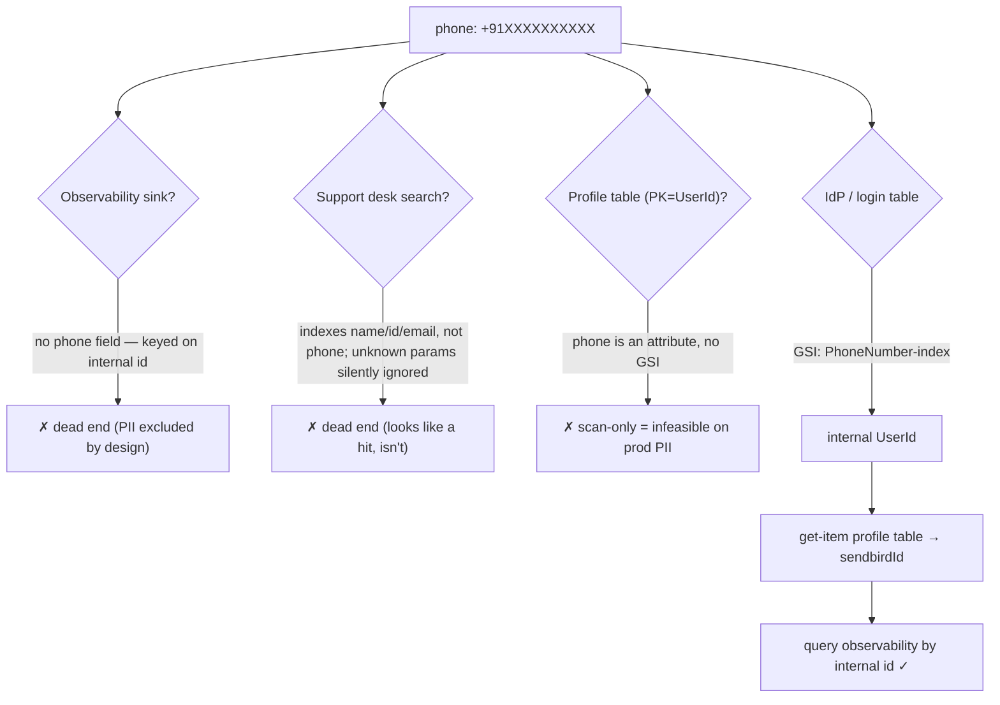

**Topic:** Resolving a phone number to an internal user ID
**Tags:** identity-resolution, observability, pii, dynamodb-gsi, debugging-method
**Summary:** Why a phone number rarely maps to an internal user ID directly, and how to find the one system that actually indexes it.

## Mental model

A phone number is user-facing PII; internal systems identify people by opaque internal IDs. Two forces make phone→ID lookup hard, and both are *deliberate*. First, observability and analytics sinks strip PII on purpose — they receive only the internal ID and maybe a display name, never the phone. Second, the same person carries different IDs in different subsystems (an auth ID, a chat ID, a support-desk customer ID), and they live in disjoint numeric ranges. So almost every lookup you can reach is **ID → data**, never **phone → ID**. The reverse direction exists in exactly one place: the identity/login system that owns the phone at signup — and only if it maintains a *secondary index* on the phone. Finding a user from their number is really about locating that one indexed table, and confirming you're allowed to read it.

## Diagram



## Prerequisites

- DynamoDB access model: you can only `Query` by partition key or a defined GSI; everything else needs a full-table `Scan`.
- How mobile/web observability SDKs set identity (a single `setUserId(id)` call), and why teams keep PII out of those events.
- The idea that one human maps to several system-specific IDs living in different numeric ranges.

## How it actually works

The method is a ladder — try each candidate source, and treat a *negative* as information, not failure:

1. **Observability / analytics (New Relic, analytics warehouse).** Inspect the schema (`keyset()` / `describe`). If there's no phone/mobile attribute, stop — the app only ever sent an internal ID. Confirm what that ID *is* by reading the app's identity call (e.g. `setUserId(user.id)`).
2. **Support / CRM desk.** Read the actual search UI config, not just the API. If categories are "Ticket ID / Customer ID" only, phone isn't searchable. Beware the silent-ignore trap: unknown params return a full page, masquerading as a match. Validate with a control value that definitely exists.
3. **Profile store.** If it's `PK=UserId` with no GSIs, phone (a plain attribute) is unreachable except by Scan. Don't Scan prod PII.
4. **Identity / login store.** This owns the phone at signup, so it (almost always) has a GSI on it. `describe-table` reveals the index; a single `Query` on that GSI resolves the number.
5. **Bridge id-spaces.** The IdP may hand back a different ID than the observability sink expects. Do the one extra hop: IdP ID → profile `get-item` → read the field that equals the observability key.

The recurring lesson: the blocker at the end is usually **access** (a read permission on the right index), not method. Name the exact action needed (`dynamodb:Query` on `table/index`) rather than asking for broad access.

## Two examples

**Example 1 — canonical (the working reverse lookup):**
```bash
# The IdP/login table has a GSI keyed on the phone. One targeted query.
aws dynamodb query --table-name idp-table --region ap-south-1 \
  --index-name 'PhoneNumber-index' \
  --key-condition-expression '#p = :ph' \
  --expression-attribute-names '{"#p":"PhoneNumber"}' \
  --expression-attribute-values '{":ph":{"S":"+91XXXXXXXXXX"}}'
# → returns the internal ID. Then bridge if needed:
aws dynamodb get-item --table-name profile-table \
  --key '{"UserId":{"S":"<id-from-above>"},"InfoType":{"S":"BASIC"}}'
# read its sendbird/observability id → query New Relic on that.
```

**Example 2 — wrong-but-tempting (the false positive):**
```bash
# Adding an unrecognized filter to a list endpoint...
GET /desk/tickets?limit=50&filters.phone=+91XXXXXXXXXX   # → 50 results
# 50 == the page size. The param was IGNORED; this is the full unfiltered page.
# Control test proves it: search a phone you KNOW exists →
GET /desk/customers?query=<your-own-number>              # → n=0
# ...while the name search returns you. The field simply isn't indexed.
```

## Why it's written this way

PII exclusion from observability is a compliance/security default, not an oversight — so "add phone to the events" is the wrong fix. ID-space separation comes from independent services minting their own keys; the join key between them is discovered, not assumed (verify with samples: N/N of the right space resolve, 0/N of the wrong space do). And a reverse lookup *must* be an index — asking the identity team for a phone GSI (or querying an existing one) is the sanctioned path, versus a table Scan which is slow, expensive, and reads everyone's PII.

## Failure modes

- **Empty result read as "user doesn't exist"** when the field simply isn't indexed. Always run a control with a known-present value.
- **Mixing id-spaces** (profile/customer ID vs auth/chat ID) → zero rows that look like "no activity". Verify the join key with samples before trusting it.
- **Silent param ignore**: unknown query params return a full page; a "hit count == page size" is a red flag, not a match.
- **Scanning prod for a non-key attribute** — infeasible at scale and a bulk-PII read; guardrails (rightly) block it.
- **Over-broad access request**: ask for the one action on the one index, not blanket read.

## Quiz

### Q1

New Relic returns rows for `userId='31'` but nothing for `userId='824045'` — the same human. Why?

**Answer:** Two id-spaces. The observability sink is keyed on the internal/chat id (~5-43k), set by the app's `setUserId`. `824045` is the Swiggy-side customer id (~821k-957k), a different namespace that never reaches NR. Querying the wrong space yields zero rows, which is easy to misread as "this user has no data."

### Q2

A support-desk list endpoint returns exactly 50 results (its page size) when you add `filters.phone=X`. Did you find the user?

**Answer:** No. Unrecognized query params are silently ignored, so 50 is just the full unfiltered first page. A genuinely applied filter returns a smaller or zero set. Validate any search parameter against a control value you know exists before trusting the endpoint.

### Q3

The profile table is `PK=UserId` with no GSIs, and phone is a plain attribute on it. Why can't you look up by phone, and what's the real fix?

**Answer:** DynamoDB can only `Query` by the partition key or a defined GSI; a non-key attribute is reachable only via a full-table `Scan`, which is infeasible and a bulk-PII read on prod. The fix is a GSI keyed on phone — which existed on the IdP/login table (`PhoneNumber-index`), not the profile table.
