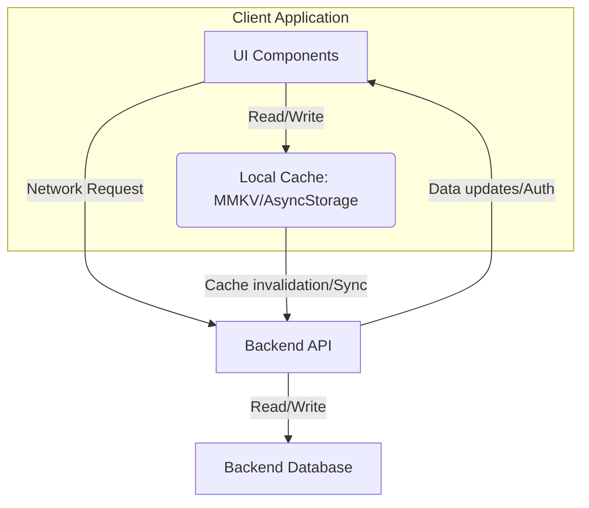

## Mental model
The core tension in deciding where to store data—client-side cache (like MMKV or AsyncStorage) or a backend server—is a fundamental trade-off between speed/availability and consistency/authority. Client-side caches provide near-instant access and offline capabilities by keeping data directly on the user's device, but at the risk of staleness, security vulnerabilities, and limited cross-device consistency. Backend storage, conversely, serves as the single source of truth, ensuring strong consistency, centralized control, and enhanced security, but always requires network access and introduces latency. The decision shapes user experience, system reliability, and development complexity.

## Diagram


## Prerequisites
*   **Client-server architecture:** Understanding how client applications (e.g., mobile apps, web browsers) communicate with remote servers.
*   **Network latency:** Awareness that network requests introduce delays and can fail.
*   **Data consistency models:** Basic knowledge of strong consistency (all clients see the same data immediately) vs. eventual consistency (data eventually propagates to all clients).
*   **Data security fundamentals:** Understanding risks associated with storing sensitive data on client devices.

## How it actually works
The decision to store data in a client-side cache or on a backend hinges on several factors, primarily the data's nature, its consistency requirements, and the desired user experience.

1.  **Client-side Cache (MMKV, AsyncStorage, file system):**
    *   **Mechanism:** Data is stored directly on the user's device (e.g., in key-value stores, SQLite databases, or plain files).
    *   **Advantages:**
        *   **Performance:** Extremely fast reads and writes as no network round trip is involved, leading to a highly responsive UI.
        *   **Offline Access:** Data is available even without an internet connection, enabling offline-first features.
        *   **Reduced Backend Load:** Less frequent requests to the server.
    *   **Best for:** User preferences (e.g., dark mode setting), temporary UI state, non-critical user-specific data, data that can tolerate some staleness, or pre-fetched content for offline use.
    *   **Why it's this way:** The goal is to minimize perceived latency and ensure functionality when network access is poor or absent.

2.  **Backend Storage (Databases, Cloud Storage):**
    *   **Mechanism:** Data resides on remote servers, typically in a database (e.g., PostgreSQL, DynamoDB) or cloud storage (e.g., S3).
    *   **Advantages:**
        *   **Single Source of Truth:** Ensures data consistency across all user devices and applications.
        *   **Security:** Backend environments can implement robust security measures, access controls, and auditing for sensitive data. [[secure-llm-api-calls-in-enterprise-backends]]
        *   **Scalability:** Can handle vast amounts of data and concurrent access from many users.
        *   **Durability:** Data is typically backed up and replicated, protecting against device loss or damage.
    *   **Best for:** Core application data, critical user information (e.g., financial data, PII), data requiring strong consistency, data shared across multiple users or devices, and data requiring complex queries or transactional integrity.
    *   **Why it's this way:** The goal is to maintain data integrity, provide multi-device synchronization, and centralize control and security.

**Prioritization Logic:**
When deciding, consider these questions:
*   **Is the data sensitive?** If yes, backend first, with robust security.
*   **Does the data need to be consistent across multiple devices or users?** If yes, backend is the source of truth.
*   **Is offline access critical for this data?** If yes, consider caching a *copy* locally, but the backend remains the master.
*   **How frequently does this data change?** Highly dynamic data is harder to cache effectively without staleness issues.
*   **What's the performance impact of fetching from the backend every time?** If it's a bottleneck, caching is a strong candidate.
*   **What's the complexity of cache invalidation and synchronization?** Overly complex sync logic can introduce more bugs than it solves, as seen in incidents like [[lru-eviction-infinite-polling-storm]].

Typically, a hybrid approach is used, where the backend is the source of truth, and a client-side cache is used for performance optimization and offline capabilities, with careful strategies for synchronization and invalidation.

## Two examples
### Example 1 — canonical
**Scenario:** A social media app displaying a user's feed and personal settings.

*   **Backend Storage:**
    *   **User's friend list, posts, comments, likes:** This data needs to be consistent across all user devices, shared with other users, and is critical to the app's core functionality. It is stored in a backend database.
    *   **Rationale:** Ensures all users see the same, up-to-date information, handles concurrent updates, and provides a central point for moderation and backup.
*   **Client-side Cache (MMKV/AsyncStorage):**
    *   **User's preferred theme (dark/light mode), notification sound settings, last viewed tab:** These are highly personal, don't need real-time sync across devices, and improve the immediate responsiveness of the UI.
    *   **Rationale:** Provides instant UI feedback, reduces network requests for non-critical settings, and works well offline.
    *   **Code Sketch (Conceptual):**
        ```javascript
        // Saving a setting
        await AsyncStorage.setItem('user_theme', 'dark');

        // Retrieving a setting
        const theme = await AsyncStorage.getItem('user_theme');
        if (theme) {
            applyTheme(theme);
        } else {
            // Fetch from backend if not found locally, or use default
            const backendTheme = await fetchUserThemeFromBackend();
            await AsyncStorage.setItem('user_theme', backendTheme);
            applyTheme(backendTheme);
        }
        ```

### Example 2 — wrong-but-tempting / edge case
**Scenario:** An e-commerce app displaying product prices.

*   **Wrong-but-tempting:** Storing `product_price` in client-side cache for all products to speed up UI loading.
    *   **Why it's wrong:** Product prices are highly critical data. If cached locally, a user might see an outdated price (e.g., during a flash sale or price change) and attempt to purchase at the wrong price, leading to financial discrepancies, customer dissatisfaction, or even legal issues. A local cache for prices would also need complex, real-time invalidation, which is hard to get right.
*   **Correct Approach:**
    *   **Backend Storage:** `product_price` is *always* fetched from the backend when displaying the product or adding it to a cart. The backend is the single source of truth for pricing.
    *   **Client-side Cache (Limited Use):** You *might* cache product *metadata* (e.g., product images, descriptions, categories) that changes less frequently, but never the price itself. Even then, an explicit refresh mechanism or short TTL (Time-To-Live) for cached metadata is crucial.
    *   **Rationale:** Prioritizes data integrity and financial accuracy over minor UI loading speed improvements. The cost of a stale price is far greater than the cost of a slightly slower load time.

## Why it's written this way
The hybrid approach of using a backend as the source of truth and a client-side cache for performance/offline access is the industry standard because it balances critical trade-offs:

*   **Alternatives:**
    *   **Backend-only:** Simpler consistency model, but results in a slow, unresponsive user experience, especially with high latency or poor network conditions. No offline functionality.
    *   **Client-side-only:** Extremely fast and fully offline, but lacks data consistency across devices, is susceptible to device loss, and has severe security implications for sensitive data. Not suitable for multi-user or critical applications.
*   **Trade-offs of the Hybrid Approach:**
    *   **Performance vs. Consistency:** Gains performance by serving cached data, but introduces the challenge of keeping that cache consistent with the backend.
    *   **Simplicity vs. Features:** Offers a richer user experience (offline, speed) but adds significant complexity in cache management, synchronization logic, and conflict resolution.
    *   **Security vs. Convenience:** Provides fast access to non-sensitive data locally, while relying on the backend for the ultimate security of sensitive information. [[authentication-tokens-bearer-tokens-and-sso]] tokens are often cached, balancing convenience with the understanding that they are short-lived and revocable.

This approach is chosen because modern applications demand both responsiveness and reliability, requiring sophisticated strategies like those managed by libraries like [[tanstack-query-server-state]] to bridge the gap between client-side rendering and backend data.

## Failure modes
1.  **Stale Data:** The most common failure. The client displays outdated information because the local cache hasn't been refreshed from the backend. This can lead to incorrect decisions (e.g., seeing an item as "in stock" when it's sold out).
2.  **Security Vulnerabilities:** Sensitive data (e.g., unencrypted PII, API keys) stored in local cache, making it vulnerable if the device is compromised.
3.  **Cache Invalidation Hell:** Complex and buggy logic for determining when to evict or update cached data, leading to unpredictable behavior, race conditions, and an inconsistent user experience. This can manifest as infinite polling storms if not carefully managed, as described in [[lru-eviction-infinite-polling-storm]].
4.  **Performance Bottlenecks:**
    *   **Over-reliance on backend:** Not caching data that could be, leading to unnecessary network requests and slow UI.
    *   **Inefficient local storage:** Storing excessively large datasets in inefficient local caches, leading to slow app startup or UI freezes during data access.
5.  **Offline Data Conflicts:** User modifies data offline, and upon reconnection, these changes conflict with updates made on the backend by another user or device, without a clear resolution strategy.
6.  **Storage Limits:** Exceeding the device's local storage capacity, causing app crashes or data loss.

## Quiz
### Q1
A user's "last viewed items" list in an e-commerce app needs to be displayed quickly but doesn't strictly need to sync across all their devices in real-time. Where would you primarily store this data, and why?
**Answer:** Primarily in a client-side cache (e.g., MMKV or AsyncStorage). This data is user-specific, benefits greatly from fast local access for UI responsiveness, and its eventual consistency across devices (or lack thereof) is acceptable. The performance gain outweighs the need for immediate, strong cross-device consistency.

### Q2
Why is a user's authentication token (e.g., a JWT) often stored in client-side persistent storage (like AsyncStorage) despite being a sensitive piece of information?
**Answer:** While sensitive, authentication tokens are stored locally for user convenience and seamless experience. They allow the user to remain logged in across app sessions without re-entering credentials. This is a trade-off: security is mitigated by making tokens short-lived, revocable by the backend, and often encrypted or secured by the OS keychain, rather than being perfectly secure. The backend remains the ultimate authority for token validation and revocation, as discussed in [[authentication-tokens-bearer-tokens-and-sso]].

### Q3
If a news app caches the full text of articles locally for offline reading, what potential problem arises if the backend later updates an article's content or removes it, and how would you typically address it?
**Answer:** The primary problem is **stale data**. The user might read an outdated version of the article or try to access an article that no longer exists on the backend. This is typically addressed by implementing a cache invalidation strategy:
1.  **Time-To-Live (TTL):** Each cached article could have an expiration time. After expiration, the app attempts to refetch from the backend.
2.  **Version Numbers/ETags:** The backend could provide a version number or ETag for each article. When fetching, the app sends the cached version, and the backend only returns new data if the version differs.
3.  **Push Notifications/Webhooks:** The backend could actively notify clients when an article changes or is removed, prompting the client to invalidate or refresh its cache.

## Links
- **Related:** [[authentication-tokens-bearer-tokens-and-sso]] — Authentication tokens are a common example of sensitive data stored in client-side cache, balancing security with user experience.
- **Related:** [[lru-eviction-infinite-polling-storm]] — Illustrates the complexities and potential failure modes of cache invalidation logic, especially when it interacts with backend requests.
- **Deepens:** [[tanstack-query-server-state]] — Explains a sophisticated library that manages server state on the client, effectively handling caching, background refetching, and synchronization complexities.
- **Contrasts:** [[secure-llm-api-calls-in-enterprise-backends]] — Emphasizes the backend's role in securing highly sensitive data, contrasting with the inherent security limitations of client-side storage.
