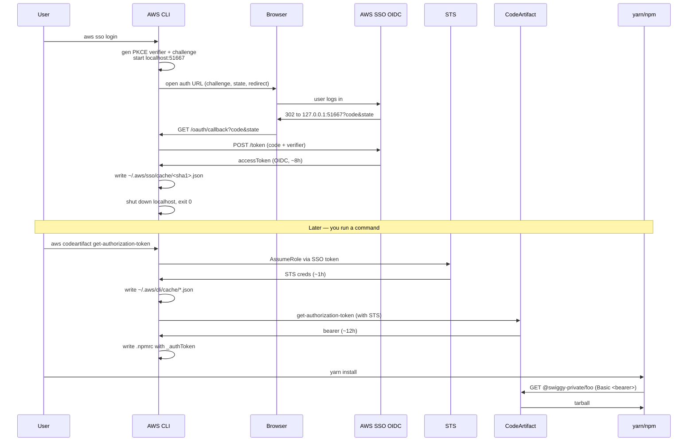

**Topic:** OAuth PKCE, AWS SSO, and CodeArtifact npm auth
**Tags:** oauth, pkce, aws-sso, codeartifact, npm-auth, monorepo
**Summary:** How AWS SSO uses OAuth PKCE to mint a token, and how that token cascades into CodeArtifact npm auth and monorepo build targets.

## Mental model

A single `aws sso login` triggers a three-layer credential chain that ultimately lets `yarn install` pull private packages. Layer 1 is **OAuth 2.0 Authorization Code Flow with PKCE**: the AWS CLI opens a browser, gets a code, and exchanges it (with a secret only it holds) for an SSO OIDC token. Layer 2 is **AWS STS**: the SSO token is exchanged for short-lived AWS API credentials for a specific role. Layer 3 is **CodeArtifact**: those STS creds are used to mint a scoped bearer token that npm understands. Each layer speaks a different protocol; each has a different TTL; each writes to a different cache file. When a build works, it's because all three are fresh. When it breaks, it's usually the layer whose TTL is shortest.

## Diagram



## Prerequisites

- Basic OAuth 2.0 vocabulary (client, authorization server, resource server, code, token)
- What a bearer token is and why it's called "bearer"
- HTTP Basic auth vs Bearer auth headers
- Familiarity with SHA-256 as a one-way hash
- Understanding of process memory vs disk persistence
- Loose knowledge of `.npmrc` and how npm resolves registries

## How it actually works

### Layer 1 — OAuth PKCE (the SSO login)

The URL `aws sso login` opens contains these params:

| Param | Purpose |
|---|---|
| `response_type=code` | Ask for a code, not the token directly. Two-step exchange lets AWS bind the code to a client. |
| `client_id` | Identifies the AWS CLI as the app requesting access. |
| `redirect_uri=http://127.0.0.1:51667/oauth/callback` | Where AWS sends the code. The CLI opened a local HTTP server on that random port before opening the browser. |
| `state=<uuid>` | CSRF nonce — proves the callback matches this request. If a stolen callback arrived with a different state, CLI would reject it. |
| `code_challenge=<sha256-of-verifier>` | Public commitment to a secret only the CLI knows. |
| `code_challenge_method=S256` | Tells AWS the challenge is SHA-256 of the verifier. |
| `scopes=sso:account:access` | What the token will be allowed to do. |

The **PKCE verifier** is a random 43-128-char string generated in memory. Only its SHA-256 hash (the *challenge*) is sent to AWS. When the CLI later exchanges the code for a token, it must present the raw verifier. AWS hashes it, compares to the stored challenge, and issues the token only on match.

**Why this matters:** if an attacker on the same machine snoops the callback URL and steals `?code=XXX`, they still cannot exchange it — they don't have the verifier (it never left the CLI's memory). This is why the CLI can safely use plain HTTP localhost for the redirect.

On success, the CLI writes `~/.aws/sso/cache/<sha1-of-start-url>.json`:
```json
{
  "startUrl": "https://swiggy-sso.awsapps.com/start",
  "region": "ap-southeast-1",
  "accessToken": "eyJlbmMi...",
  "expiresAt": "2026-08-12T21:00:00Z",
  "clientId": "…",
  "clientSecret": "…"
}
```

### Layer 2 — STS credentials

The SSO `accessToken` is not what AWS APIs accept. It's an **OIDC token**, not an AWS SigV4-signed request. When you run any `aws` command with `--profile default`:

1. boto reads `~/.aws/config` to find the profile's `sso_role_name` and `sso_account_id`.
2. Reads the SSO token from `~/.aws/sso/cache/<hash>.json`.
3. Calls `sso:GetRoleCredentials` (with the SSO token as bearer) to get STS credentials for that role.
4. Writes them to `~/.aws/cli/cache/*.json` (~1h TTL).
5. Signs the actual API call with those STS creds.

If step 4's cache is still fresh, step 3 is skipped. This is why sometimes `aws` commands run silently for hours after a login — the STS creds keep getting refreshed as long as the SSO token is valid.

### Layer 3 — CodeArtifact npm auth

npm/yarn cannot speak AWS SigV4. They speak HTTP Basic auth via a token in `.npmrc`. `aws codeartifact get-authorization-token` bridges the two:

```bash
TOKEN=$(aws codeartifact get-authorization-token \
  --domain swiggy \
  --domain-owner 157529275398 \
  --query authorizationToken --output text)
```

This call uses your STS creds (SigV4-signed), and CodeArtifact returns a bearer token (~12h TTL) scoped to the domain. The `make create-npmrc` target writes it into `.npmrc`:

```
registry=https://swiggy-157529275398.d.codeartifact.ap-southeast-1.amazonaws.com/npm/private/
//swiggy-157529275398.d.codeartifact.ap-southeast-1.amazonaws.com/npm/private/:_authToken=<TOKEN>
```

Now `yarn install` works — for exactly 12 hours.

### make targets in the monorepo

Two-target split is standard React Native pattern:

```makefile
android-setup:
    make create-npmrc
    yarn install --immutable
    cd android && ./gradlew clean

android:
    yarn start &
    yarn react-native run-android
```

`android-setup` is idempotent and slow (fresh install, gradle warm-up). `android` is the fast inner loop. Keeps CI setup targets separate from dev iteration.

## Two examples

**Example 1 — canonical fresh-clone bootstrap:**
```bash
git clone <monorepo>
cd monorepo
aws sso login --sso-session swiggy   # OAuth PKCE, writes SSO cache
make create-npmrc                     # STS + CodeArtifact, writes .npmrc
make android-setup                    # yarn install, gradle prep
make android                          # metro + build + run
```

**Example 2 — the "expired token" trap:**
```bash
# Yesterday's SSO token has expired overnight
$ yarn install
error An unexpected error occurred: "https://swiggy-...codeartifact.../@swiggy-private/foo: 401 Unauthorized"

# Wrong fix: rerun yarn install
# Right fix: chase the expired layer
$ aws sso login --sso-session swiggy   # refresh Layer 1
$ make create-npmrc                     # refresh Layer 3 (writes new .npmrc)
$ yarn install                          # now works
```

If only `.npmrc` is expired but SSO is still valid, `make create-npmrc` alone is enough. If SSO is expired, everything downstream fails until you re-login.

## Why it's written this way

**Why OAuth code flow + PKCE and not username/password:** SSO federates identity to an IdP (Okta, Azure AD, etc.). The AWS CLI cannot handle the IdP's login UX — MFA prompts, WebAuthn, conditional access. So the browser handles login, the CLI just catches the resulting code.

**Why the SSO token doesn't work directly on AWS APIs:** AWS APIs require SigV4 (a request-signing scheme with expiring signatures). Handing raw bearer tokens over the wire on every API call would be a downgrade — every network hop could replay them. STS credentials + SigV4 mean each request is signed with a timestamp and can't be replayed after 15 min of clock skew.

**Why CodeArtifact needs its own token layer:** npm was designed before AWS existed. Retrofitting SigV4 into `yarn install` would require patching npm itself. CodeArtifact chose the compatible path: mint a bearer that fits npm's existing `_authToken` header.

**Why make targets not a single script:** Makefiles give free dependency graph resolution. `make android` depends on `.npmrc` existing → make sees `.npmrc` is missing → runs `create-npmrc` → then continues. A shell script would need to write this dependency check by hand.

## Failure modes

- **Killing `aws sso login` mid-browser leaves nothing to catch the callback.** Even if you complete the SSO login in the browser, the CLI's localhost server is dead. No error appears — the browser just shows "This site can't be reached" and the login is stuck. Fix: rerun `aws sso login`.
- **CodeArtifact token in `.npmrc` expired after 12h; the next `yarn install` hits 401.** The error message doesn't mention CodeArtifact — it just says 401. Fix: `make create-npmrc` again.
- **SSO token expired but STS cache still fresh.** Some `aws` commands work (STS cache), others fail (they need to re-derive STS). Confusing partial failure. Fix: `aws sso login`.
- **`registrationExpiresAt` (~90 days) hit.** Even after `aws sso login`, first call fails because the client registration itself expired. AWS CLI usually re-registers automatically, but on old CLI versions you must `rm ~/.aws/sso/cache/botocore-client-*` first.
- **Wrong AWS profile.** `--profile default` maps to a specific account+role. If you're logged into SSO but the profile points to a different account, `get-authorization-token` fails with AccessDenied.
- **Clock skew > 15 min.** SigV4 rejects requests with timestamps outside a 15-minute window. All `aws` commands mysteriously return `SignatureDoesNotMatch`. Fix: sync system time.
- **PKCE verifier gets logged by mistake.** If a debug-verbose flag prints the verifier to logs, it defeats PKCE. AWS CLI is careful about this; custom OAuth clients often aren't.

## Quiz

### Q1

Why does killing `aws sso login` mid-browser break the login even if the browser completes the redirect?

**Answer:** The PKCE verifier and the local HTTP callback server both live only in the CLI process's memory. When the CLI dies: (1) port 51667 closes so the browser redirect hits nothing, (2) even if the code were captured somehow, the verifier is gone — and without it the code alone cannot be exchanged for a token. That's the whole point of PKCE.

### Q2

What's the difference between the token in `~/.aws/sso/cache/` and the credentials in `~/.aws/cli/cache/`?

**Answer:** SSO cache holds the OIDC accessToken (proof you're logged into SSO, ~8-12h TTL). CLI cache holds short-lived STS credentials (AccessKeyId + SecretAccessKey + SessionToken, ~1h TTL) minted for a specific role by exchanging the SSO token. Every `aws` call reads the STS creds; when they expire, boto refreshes them using the SSO token.

### Q3

`make create-npmrc` writes an `.npmrc` with a token. Why is this token different from your SSO login, and how is it generated?

**Answer:** It's a CodeArtifact authorization token — a bearer that npm can use as HTTP Basic auth (npm doesn't speak AWS auth). It's minted by `aws codeartifact get-authorization-token`, which uses your STS creds (themselves derived from SSO). ~12h TTL. Without it, `yarn install` gets 401 on any @swiggy-private/* package.
